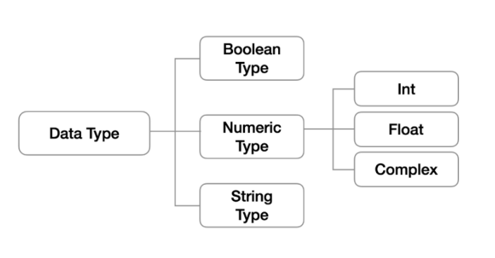
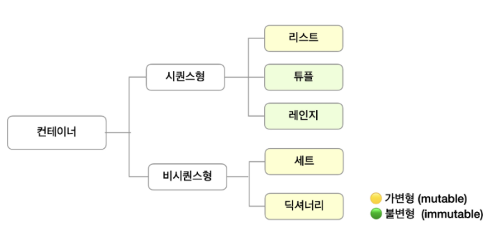

# 파이썬 개발 환경

###		파이썬이란?

- 문법 간단, 표현 간결
- 다양한 운영체제에서 실행 가능
- 특징
  - 인터프리터 언어: 컴파일 과정 없이 바로 실행 가능(↔ 컴파일 언어)
  - 객체지향

### 	파이썬 개발환경

- 종류
  - **대화형** 환경: 파이썬 기본 Interpreter, **Jupyter Notebook**
  - 스크립트 실행: IDE, Text Editor


# 기초 문법

- 코드 스타일: PEP8 => 파이썬에서 제안하는 스타일 가이드
  - [PEP8](https://www.python.org/dev/peps/pep-0008)
- 들여쓰기(indentation): 4 space or 1 Tab을 일반적으로 사용하고 space 사용을 권장


### 	변수 

- 컴퓨터 메모리 어딘가에 저장되어있는 객체를 참조하기 위해 사용되는 이름. '박스'를 떠올리자.

- 값을 할당할 때는 연산자 '=' 사용

- `type()`, `id()`

- 변수 연산

  - 문자열을 할당받은 변수와 문자열 간 연산도 가능

- 변수할당

  - 예제) 

  - ```python
    x, y = 10, 20
    #x와 y 값을 바꿔서 저장하는 코드
    tmp = x
    x = y
    y = tmp
    print(x, y) #x = 20, y = 10
    --------------------------------------
    x, y = y, x
    ```

- 식별자

  - 파이썬 객체를 식별하는데 사용하는 이름. 박스의 이름

  - 알파벳, _, 숫자로 구성 / 첫 글자에 숫자는 불가능 / 대소문자 구별

  - 예약어는 사용 불가능

    ```python
    import keyword
    print(keyword.kwlist)
    ```

  - 내장함수나 모듈 등의 이름도 불가능

- 주석

  - 주석 다는 습관 중요
  - 속도에 영향 X, 코드 실행에 영향 X, 용량 증가 X
  - #: 한줄 주석 
  - """ or ''': 여러줄 주석


# 자료형



- None: 값이 없음을 표현
  - `a = None`
- Boolean: True / False
  - False로 변환되는 것들: 0, 0.0, ( ), [], {}, '', None
  - `Boolean([0]) = True`

- 수치형(Numeric)
  - 정수형(int): 매우 큰 수를 나타낼 때 오버플로우가 발생하지 않음
    - 오버플로우: 데이터 타입별로 사용할 수 있는 메모리의 크기를 넘어서는 상황. C언어 혹은 자바에서는 충분히 큰 값의 정수형 데이터를 다룰 때에는 overflow를 고려하여 long 타입을 사용해야함. 하지만 파이썬에서는 그럴 필요가 없다.
  - 진수표현
    - 2진수: 0b
    - 8진수: 0o
    - 16진수: 0x
      - tip: box로 기억하면 쉽다

- 실수(Float)

  - floating point rounding error: 컴퓨터는 실수를 2진수(비트)로 표현하는데 이과정에서 부동소숫점 반올림 오류가 발생. 실수 연산 과정에서 발생 가능하며 이로 인해 실수 값을 비교할 때는 주의가 필요함

  - 정확한 비교를 위한 방법

    ```python
    a = 3.13 - 3.12
    b = 0.01
    
    print(a == b)
    
    #1. 임의의 작은 수
    print(abs(a - b) <= 1e-10)  #1e-10은 0.00...01로 엄청나게 작은 수
    
    #2. system 상의 machin epsilon
    import sys
    print(abs(a-b) <= sys.float_info.epsilon)
    print(sys.float_info.epsilon)
    
    #3. Python 3.5 이상
    import math
    math.isclose(a, b)
    
    #결과
    False
    True
    True
    2.220446049250313e-16
    True
    ```

    #1과 #2는 엄청나게 작은 수보다 abs(a - b)가 작은지 확인해서 True라고 나오면 결국 a == b라고 볼 수 있다는 것이고, #3은 math 모듈을 통해 확인하는 방법

- 복소수(Complex)

  - 허수부: j로 표현

- 문자열(String Type)

  - 특징
    - immutable: 특정 값 하나만 바꿀 수 없다. 예를 들면 `a = apple`일 때 맨 마지막 알파벳만 f로 바꿀 수 없음
    - iterable: 반복 가능함. 반복 가능하다는 것은 for문으로 그 값을 출력할 수 있음을 의미한다.
  - Escape sequence
    - \\ 를 활용하여 문자열 내에서 특정 문자를 입력하거나 조작
    - \n, \t, \\', \\", \0, \r 등
  - String Interpolation
    - %-formatting, str.format(), f-strings: %d 포맷팅으로 숫자를 입력받아도 출력된 문자열 내에서 해당부분은 결국 string type임

- None: 값이 없음을 표현


# 컨테이너

- 여러 개의 값을 담을 수 있는 것
- List, tuple
- 순서가 있는 데이터 vs 순서가 없는 데이터로 분류
- 순서가 있다 != 정렬되어 있다.
- 

### 시퀀스형 컨테이너

- 리스트
  - 순서 O
  - 내용 변경 가능
  - 인덱스로 접근 가능
- 튜플
  - 순서 O
  - 객체 변경 불가
  - 인덱스로 접근 가능, but 수정은 불가능
- 레인지
- 패킹/언패킹
  - `x, *y = i, j, k ...`: i는 x에, 나머지는 y에 할당됨
  - 한번에 두개이상 *연산자는 사용이 안됨
  - `*x, y = i, j, k ...`도 당연히 가능
  - 패킹의 경우 리스트로 대입, 언패킹의 경우 튜플 형태로 대입


### 비시퀀스형 컨테이너

- 셋(Set)
  - immutable한 객체만 담을 수 있음(따라서 list 같은건 못담음)
  - mutable한 자료형: 담고 있는 객체를 삽입, 변경, 삭제 가능
  - 집합연산가능, 중복된 값 X
  - 빈 Set을 만들려면 `a = {}`는 안됨. 이것은 딕셔너리고, `a = set()`를 해주어야 함
  - 순서가 없으므로 인덱스를 통한 접근 불가
  - 중복불가이므로 이 특성을 이용해 다른 컨테이너에서 중복된 값 쉽게 제거 가능하나 이후 순서가 무시되므로 순서가 중요할 때는 사용 불가

- 딕셔너리
  - 순서 X, 키-값(key-value) 쌍으로 이뤄진 객체를 참조
  - key에는 해시가능한 불변 자료형만 가능
  - value는 어떤 형태든 상관 X
  - 생성: `a = {}` or `a = dict()`
  - key를 통해 value에 접근, value를 통해 key에 접근하는 것은 불가능


- immutable 자료형: string, integer, float, boolean, tuple, range


# 형 변환(Typecasting)

### 암시적 형 변환(Implicit)

- 사용자의 의도와 무관하게 파이썬 내부적으로 변환


### 명시적 형 변환(Explicit)

- 의도적으로 특정 함수 활용하여 자료형 변환
- 형식에 맞아야 함


# 연산자(Operator)

### 논리 연산자

- 논리 연산자 단축평가
  - 결과가 확실할 때 두 번쨰 값 확인 X
  - 예를 들어 `a and b`일 때 a가 `False`이면 b값과 관계없이 `False`이므로 b값은 확인하지 않음
  - 첫 번째 값에서 결과가 확실하면 첫번째 값 반환, 두 번째 값 확인 필요하다면 두 번째 값 반환

### 시퀀스형 연산자

- 산술연산자(+)

  - `[1, 2] + ['a']` = > `[1, 2, 'a']`

  - 튜플, 문자열도 가능하나 range는 불가능

- 반복연산자(*)

  - 리스트, 튜플, 문자열 가능, range 불가능
  - `(1, 2) * 3` => `(1, 2, 1, 2, 1, 2)`

### 슬라이싱(Slicing)

- 리스트/튜플/range/문자열
- `list(range(10)[1:5:3])` => `[1, 4]`
- `a[시작인덱스 : 끝 인덱스 + 1 : 간격]`
- 간격을 음수로 두면 뒤에서부터 출력됨
- 간격이 양수인데 시작인덱스가 끝인덱스보다 크거나, 간격이 음수인데 시작인덱스가 끝인덱스보다 작으면 빈 컨테이너가 출력됨
- 인덱스 생략 가능

### set 연산자

- |: 합집합, &: 교집합, -: 여집합, ^: 대칭자()


# 보충

- jupyter notebook 해서 열린 페이지는, jupyter notebook을 연 위치임
- 파이썬 코드를 작성, 실행 할 수 있는 노트
- vs code 쓰면 안되나요?
  - 파이썬 코드 작성 후 실행했을 때 코드가 사라지지 않음
  - 복습하기에 좋음
  - 데이터 분석 분야로 간다면 굉장히 많이 씀
  - 마크다운도 가능
- 코드 입력 후 Shift + Enter
- 셀 앞부분을 클릭하고 'm'입력하면 앞에 'In'이 사라지고 마크다운 사용하여 기록 가능해짐. 내용을 입력하고 Shift + Enter
- 마크다운 상태에서 'y'를 누르면 다시 코드 입력 상태로 바뀜

---

질문

- 단축평가
  - 결과가 확실할 때 두번째값은 확인하지 않고 첫번째 값 반환
  - ex) 100 > 50 or 50 < 30: 앞부분은 True, 뒷부분은 False. 이때 or 연산자일 때 둘중 하나라도 True이면 전체가 True. 이때 앞부분이 이미 True이므로 뒷부분과 관계없이 True가 되므로 뒷부분은 보지 않는다는 말
- 패킹, 언패킹
  - 시퀀스형: 순서가 있는 자료형
  - x, *y = i, j, k ...: x에는 i가 할당되고, *y에는 나머지가 시퀀스 자료형으로 묶여서 y에 할당됨
  - 패킹할 때는 리스트, 언패킹할 때는 튜플로 한다는 건, '순서'에 의미가 있음.
- 인터프리터 언어 vs 컴파일 언어
  - 컴파일 언어: 컴파일러가 붙어있는 언어. 
    - 컴파일러란?: 사람이 작성한 것을 기계가 이해하는 언어로 번역해주는 것

# 


### 제어문

- 코드를 실행할 때: 위에서 아래로 순차적 실행. 우측의 값을 좌측에 할당


#### 	조건문

- 복수조건문에서 `else`에는 나머지 모두가 들어가기 때문에 expression이 들어가면 안됨

- `SyntaxError`: 문법적 오류


#### 	반복문

- while문/for문

  - for: 반복 가능한 애들을 하나씩 꺼내줌. 다 꺼내면 종료
  - while: 조건이 참일 때 실행. 그래서 조건이 계속 참이라면 무한루프. 따라서 종료조건(조건이 거짓이 되도록)을 만들어 줘야함.
  - 이러한 반복문을 통해 어떤 결과값을 도출하고 싶다면 결과값을 담을 변수를 초기화 해주어야함.

- 문자열 순회

- 딕셔너리 순회: 기본적으로 "key"를 순회한다.

  - keys(), values(), items()

  - ```python
    grades = {'kim': 80, 'lee': 100}
    #1. 딕셔너리 순회 => key!!
    for key in grades:
        print(key, grades[key])
    #2. keys
    for key in grades.keys():
        print(key, grades[key])
    #3. values
    for value in grades.values():
        print(value)
    #4. items
    for key, value in grades.items():
        print(key, value)
    
    print(grades.items())
    print(type(grades.items()[0]))    
    ```

    #3에서 value들을 뽑을 수는 있는데, value로 key를 찾을 수는 없다. 

  - 딕셔너리는 원칙적으로는 순서가 없음. 그래서 인덱싱이 아니라 key로 접근해야 함.

- enumerate 순회

  - ```python
    seasons = ['spring', 'summer', 'fall', 'winter']
    list(enumerate(seasons))
    => [(0, 'spring'), (1, 'summer'), (2, 'fall'), (3, 'winter')]
    list(enumerate(seasons, start = 1))
    => [(1, 'spring'), (2, 'summer'), (3, 'fall'), (4, 'winter')]
    ```

- list comprehension

  - ```python
    cubic_list = []
    for number in range(1, 4):
        cubic_list.append(number ** 3)
    cubic_list
    
    =>
    
    [number ** 3 for number in range(1, 4)]
    ```

  - 연습문제

    ```python
    #1~30까지 숫자 중에(반복)
    #홀수만(조건)
    #1-1. 빈통
    numbers = []
    for i in range(1, 31):
        if i % 2 == 1:
            numbers.append(i)
    print(numbers)
    
    numbers_2 = [i for i in range(1, 31) if i % 2 == 1]
    print(numbers_2)
    ```


- dictionary comprehension

  - ```python
    #1~3의 세제곱 딕셔너리 만들기
    #1.
    cubic_dict = {}
    
    for number in range(1, 4):
        cubic_dict[number] = number ** 3
    cubic_dict
    ---------------------
    {1: 1, 2: 8, 3: 27}
    
    #2.
    {number: number ** 3 for number in range(1,4)}
    ```

  

#### 	반복문 제어

- break: 반복문을 종료시킴

- continue: `continue` 이후의 코드 블록은 수행하지 않고, 다음 반복을 수행

  - ```python
    for i in range(6):
        if i % 2 == 0:
            continue
        print(i)
    ```

    i가 2일 때 i % 2 = 0이므로, `print(i)`를 실행하지 않고 i = 3으로 넘어감

- pass: 아무 것도 하지 않음. 특별히 할 일이 없을 때 자리를 채우는 용도.

  - ```python
    #pass와 continue
    for i in range(3):
        if i > 1:
            pass              => 0 / 1 / 2 출력
        print(i)
    print('=================')
    for i in range(3):
        if i > 1:
            continue          => 0 / 1 출력
        print(i)
    ```

    `pass`는 사실상 없는 코드. 윗 코드에서 `if i > 1:`은 있고 `pass`는 없다면 에러가 남. 그래서 일단 구조를 잡아놓고 세부 내용은 나중에 작성하고자 할 때 많이 씀

- else: **끝까지** 반복문을 실행한 이후에 실행. `if`에서의 `else`와는 약간 다름. 그래서 반복문이 중간에 `break` 등으로 중단된다면 `else`문이 실행되지 않음.

  - ```python
    #1
    is_b = False
    
    for char in 'apple':
        if char == 'b':
            is_b = True
            break
    else:
        print('b가 없습니다.')
    -----------------------------------------
    #2
    is_b = False
    
    for char in 'apple':
        if char == 'b':
            is_b = True
            break
        else:
            print('b가 없습니다.')
    ```
    
    #1과 #2의 차이점을 알아보자. #1의 경우 `for-else`문이고 #2는 `if-else`문이다. #1에서 `for`문 실행 결과 'apple'에 b가 없어서 결국 `break`되지 않았고, 반복문이 끝까지 실행 되었기 때문에 `else`문이 실행되어 'b가 없습니다.'가 한 번 출력된다.
    
    #2는 `if-else`문이 `for` 반복문 내에 포함되어 있다. 그래서 'apple'의 각 철자마다 b인지 확인하여 b가 아니라면 'b가 없습니다.'를 출력하므로, #2의 실행 결과는 'b가 없습니다.'가 5번 출력된다.
