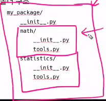
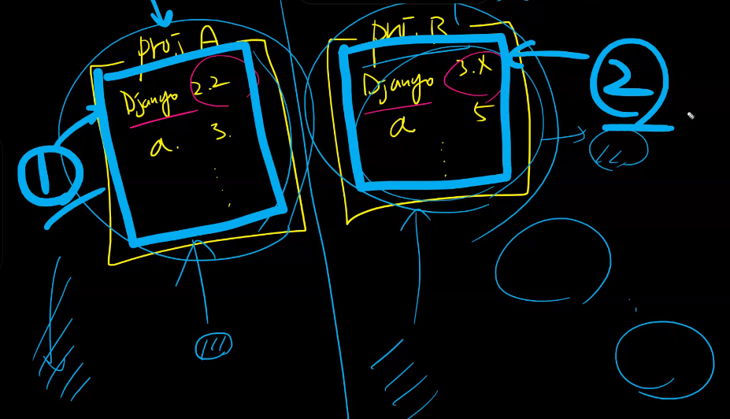

# 모듈

- 함수: 같은 기능을 위한 코드의 묶음
- 모듈: 특정 기능을 하는 코드를 파이썬 파일(.py)단위로 작성한 것
- 패키지: 모듈의 묶음
- 라이브러리: 패키지의 묶음


- `import module ` == `from module import *`
  - 정규표현식
  - 차이점이라면, `import module`에서는 `module.~()` 이런 식으로 써야 하는데 `from module import *`는 그냥쓸 수 있다. `~()`
- `from module import var, function, Class`
  - module 전체를 불러오는건 비효율적인 것 같아서 쓸 것만 불러오는 경우

- 파이썬 표준 라이브러리
  - `math, random` : 처음부터 모든 걸 다들고 있으면 메모리가 너무 무거워지기 때문에 `import`해서 써야 함
  - `print` 같은 애들은 시작부터 파이썬이 들고 있는 애들
- 파이썬 패키지 관리자(pip)
  - 외부 패키지: 파이썬을 가장 강력하게 만들어주는 요소. PyPI(Python Package Index)에 저장되어 있고, pip를 통해 설치

- `$ pip install Somepackage == 1.0.5`
- $ `pip install SomePackage`: SomePackage의 가장 최신버전을 설치해줌
  - 무조건 최신 버전이 좋은게 아님. 버전이 달라지면 코드가 달라질 수도 있고 그동안 작성했던 코드가 무용지물이 될 수 있음
  - 그래서 개발할 때 사용한 버전이 무엇인지 확인하는 것이 중요 

- `$ pip freeze`: 내가 설치한 패키지의 목록과, 패키지의 버전을 딱 그 시점으로 얼려주는 것. 이것을 `requirements.txt`(관습)으로 만들어서 관리함
  - `$ pip freeze > requirements.txt`
- `$ pip install -r requirements.txt`
  - requirements를 읽고 자동으로 그 버전에 맞게 설치
- PyTorch: 딥러닝하는 라이브러리
- 모든 폴더에는 `__init__.py`를 만들어 패키지로 인식
  - 3.9버전부터는 없어도 인식이 됨. 하지만 3.3버전 미만은 `__init__.py`가 있어야만 패키지로 인식
    - 예를 들어 my 폴더에 check.py, math.py가 있을 때 여기에 `__init__.py`가 있어야만 my폴더를 패키지로 인식함. 그러므로 3.3버전 이상에서도 그 미만의 버전을 사용하는 사람들을 위해 `__init__.py`를 만들기를 권장
  - 폴더 내에 또 패키지 폴더가 있다면, 그 내부 폴더에도 각각 `__init__.py`가 있어야 함




- 가상환경

  - project A: Django 2.2, a패키지 ver3
  - Project B: Django 3.x, a패키지 ver5
  - 이렇게 수많은 패키지들이 있는데, 하나의 컴퓨터 안에서 패키지는 같은데 버전이 다른 경우가 많음
  - 가상환경이 없으면 각 프로젝트를 실행할 때마다 버전에 맞게 지웠다가 새로 설치했다가 반복해야함
  - 그래서 가상환경은 각각의 패키지를 따로따로 설치할 수 있는 환경을 제공 
  - 

  - `venv`: 파이썬 3.5부터 지원을 했고, 그 이전 버전에서는 외부프로그램을 썼음
    - 특정 디렉토리 안 쪽에 가상 환경을 만들고, 고유한 파이썬 패키지 
    - 
  - 가상환경 생성
    - `$ python -m venv <폴더명>`
  - 동일 컴퓨터에 여러 개의 가상환경 가능
  - 가상환경 비활성화
    - 가상환경을 활성화하고 나면 그 폴더에서 나가도 그 상태가 유지됨
    - 그래서 `$ deactivate` 명령어 필요


---------

- 변수 선언시에는 띄어쓰기 하는게 좋고, argument로 넘겨줄 때는 띄어쓰기 안하는 게 좋다.

  - `n = 5`
  - `print('*', end="")`

- ```pytho
  lst = [1, 2, 3, 4]
  lst.extend([8, 9])
  print(lst)
  ------------------
  lst = [1, 2, 3, 4, 8, 9]
  #extend는 반복가능한 자료형만 가능
  #lst.extend(10)은 불가능
  #lst.extend('abcd')
  -> [1, 2, 3, 4, 'a', 'b', 'c', 'd']
  ```

- sorted없이 정렬 구현하기

  ```python
  for i in range(len(numbers)-1):
      for _ in range(len(numbers)):
  	    if numbers[i] > numbers[i+1]:
      	    numbers[i], numbers[i+1] = numbers[i+1], numbers[i]
      	#밑의 for문만하면 완전히 정렬이 되지 않고, 가장 큰 수가 끝으로 감
      #버블소트
  ```

- `a = float('inf')` : 아주 큰 수 만들기

- `list.append()`의 속도는 굉장히 빠름. 반면에 `list.remove()`의 속도는 느림

- ```python
  a = 3.6
  ---> int(a) = 3
  a = '3.5'
  ---> int(a) : Error
  ```

-  ```python
   def name_and_location(name, location):
       ~~
   에서
   name_and_location('구미', name='길동')  #오류
   ```


---

### JSON

- Data를 표현하는 방법 중 하나. Key, Value로 이루어져있는 표현법. 파이썬과는 관련이 없고 그냥 데이터를 저장하는 방법

- Java Script Object Notation: 자바스크립트의 객체를 Notation하는 방법 중 하나였는데, 워낙 편리하다보니 다른 언어에서도 지원하기 시작

- 관통PJT에서 이런 식으로 데이터가 주어지면, 이것을 읽어와서 Python으로 데이터를 가공해야 함

- Data를 읽어들이는 방법

  - `import json`
  - `open(a, b)`: a는 파일의 경로 / b는 쓰기(w), 읽기(r), 수정모드(a)
  - `encoding='UTF-8'
  - readline: 한줄씩 읽어옴
  - readlines: 한번에 

- file을 불러와서 다써줬으면, file을 닫아줘야함

- ```python 
  with open('data/data.json', 'r', encoding='UTF-8') as file_stream:
  	data = json.load(file_stream)
      for each_dict ....
  ```

  with open ~ as 세트로 보면 됨. 개발자들이 close하는 것을 자꾸 까먹어서 만들어진 거

- 