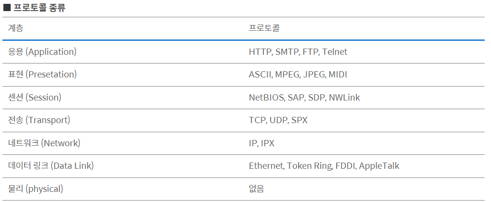
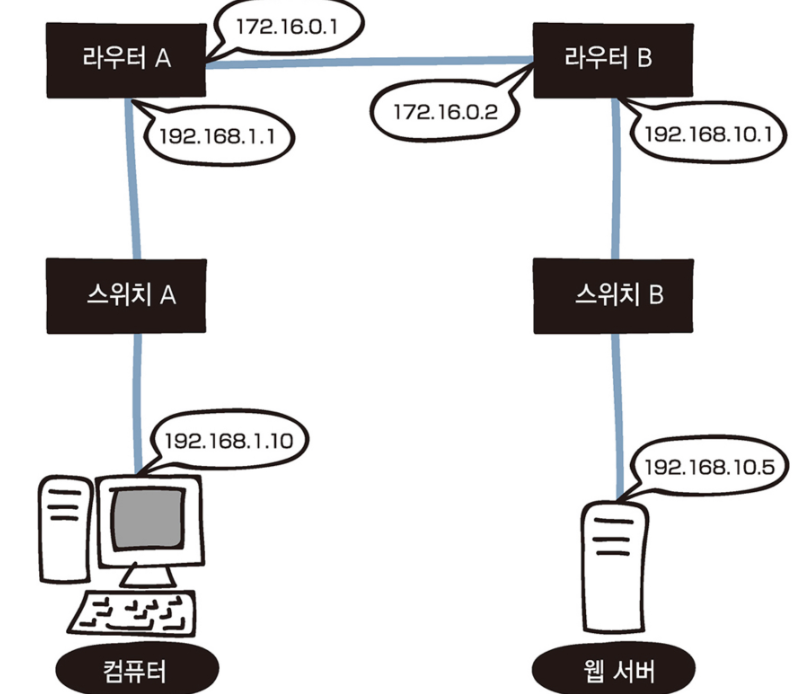
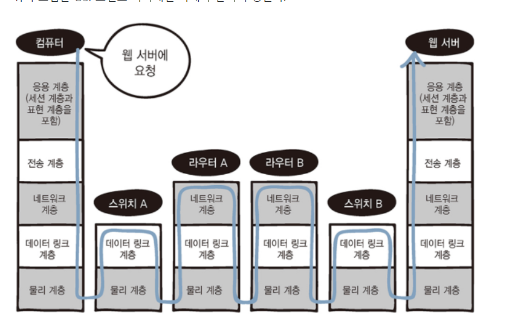

# 8장

[TOC]

# 랜 카드에서의 데이터 전달과 처리

## 네트워크의 구성

### OSI 응용계층 ~ 물리계층

#### 프로토콜의 종류

- 물리계층에도 RS-232, X.25, X.21 등의 프로토콜이 있긴하다

#### 계층별 역할/키워드

- 응용계층(+ 표현,세션 계층)
  - 다양한 애플리케이션이 동작하는 계층
  - 웹서버 - HTTP, HTML, URL, keepalive
  - DNS 서버 - 도메인, IP
    - 한개의 도메인에 여러개의 ip 가능

- 전송계층
  - 신뢰할 수 있는 데이터의 순차적 전달.  오류 점검, 데이터의 목적지인 애플리케이션 식별
  - 연결형, 비연결형 통신
  - TCP, TCP헤더, 세그먼트
  - 3-way/4-way handshake, SYN, ACK, FIN
  - 일련번호, 확인응답번호, 윈도우 크기, 버퍼, 포트번호
  - UDP, UDP 헤더, UDP 데이터그램

- 네트워크계층
  - **다른 네트워크**간 통신을 위한 경로설정을 위해 라우터를 통한 라우팅
  - 패킷 전송
  - 라우터, 라우팅, 라우팅 테이블
  - IP 주소, IP헤더, IP패킷
  - 네트워크 주소, 브로드캐스트 주소
  - 서브넷, 서브넷마스크, 서브네팅

- 데이터링크계층
  - **네트워크 기기간** 데이터 전송 및 물리주소 결정
  - 이더넷, CSMA/CD 방식
  - 이더넷 헤더, 이더넷 프레임, 트레일러
  - MAC 주소(출발지/목적지)
  - 스위치
  - 전이중통신, 반이중통신
    - duplex mismatch
    - https://en.wikipedia.org/wiki/Duplex_mismatch

- 물리계층
  - 데이터를 전기 신호로 변환
  - 랜 카드, 케이블

### 네트워크의 구성

- 스위치만 있는 네트워크에서는 모든 컴퓨터와 스위치가 동일한 네트워크에 속함
- 네트워크를 분리하는 것은 라우터(물리적인 구분)
- cf) VLAN: 논리적 구분
- 
- 

## 컴퓨터의 데이터가 전기 신호로 변환되는 과정

> 컴퓨터의 웹 브라우저에 URL을 입력할 때부터 웹 서버에 도착할 때까지 이루어지는 OSI 모델의 캡슐화와 역캡슐화 과정

- 3-way handshake는 이미 완료되어 연결은 확립되어 있다고 가정

- 웹브라우저에 URL 입력 후 Enter
- 응용계층: html 데이터를 보내달라는 HTTP 메시지 보냄
- 전송계층: 이 데이터가 전달되고 TCP 헤더가 붙음
  - TCP 헤더에는 출발포트 번호와 도착포트 번호 등의 데이터가 있고
  - 전송계층에 도착한 데이터는 이러한 정보를 담은 TCP 헤더가 붙은 세그먼트가 됨
- 네트워크 계층: IP 헤더를 붙여서 IP 패킷이 됨
  - IP 헤더에는 출발지 IP주소, 목적지 IP 주소 등이 포함
- 데이터링크 계층: 전달된 데이터에 이더넷 헤더가 추가되어 이더넷 프레임이 됨. 트레일러도 추가
- 물리계층: 전달된 데이터가 전기신호로 변환되어 네트워크로 전송. 여기서 랜 카드가 필요

- 이렇게 상위계층에서 하위 계층으로 내려오면서 데이터가 추가되는데, 이러한 과정 하나하나를 캡슐화라고 함

  |   계층/데이터   |           추가되는 데이터           |  데이터 명칭   |
  | :-------------: | :---------------------------------: | :------------: |
  |  전송계층(TCP)  |         TCP 헤더(포트번호)          |    세그먼트    |
  |  전송계층(UDP)  |              UDP 헤더               | UDP 데이터그램 |
  |  네트워크 계층  |           IP 헤더(IP주소)           |    IP 패킷     |
  | 데이터링크 계층 | 이더넷 헤더(MAC주소), 트레일러(FCS) | 이더넷 프레임  |

  

# 스위치와 라우터에서의 데이터 전달과 처리

## 스위치에서의 데이터 전달과 처리

### 스위치 A

- 스위치: 2계층 장비

- 컴퓨터에서 들어온 데이터가 전기신호로 변환되어 데이터링크 계층으로 전달
- 물리계층에서 데이터를 전기 신호로 변환하여 라우터로 전송

## 라우터에서의 데이터 전달과 처리

- 라우터는 3계층 장비

### 라우터 A

- 스위치에서 데이터가 전기신호로 변환되어 케이블을 통해 라우터에 도착
- 데이터 링크 계층에서 이더넷 프레임의 목적지 MAC 주소와 자신의 MAC 주소를 비교
- 주소가 같으면 이더넷 헤더와 트레일러를 분리하는 역캡슐화 수행
- 네트워크 계층에 전달하고 라우팅 테이블과 목적지 IP 주소 비교
- 라우팅 테이블에서 목적지 IP 주소의 경로를 알 수 있으므로 라우팅 가능
- 라우팅이 가능하므로 현재 IP 주소를 라우터의 외부 IP 주소로 변경
- 데이터링크 계층으로 전달
- 다음 라우터로 보내지도록 이더넷 헤더와 이더넷 트레일러를 붙인 후 물리계층에 전달
- 물리계층에서 데이터를 전기 신호로 변환하여 네트워크로 전달

### 라우터 B

- 데이터가 전기신호로 변환되어 케이블을 통해 라우터 B로 도착
- 이더넷 프레임의 목적지 MAC 주소와 자신의 MAC 주소 비교
- 주소가 같으면 이더넷 헤더와 트레일러 분리(역캡슐화)
- 네트워크 계층으로 전달
- 자신의 라우팅 테이블과 목적지 IP 주소를 비교
- 여기서 또 비교하는 이유는 라우터 B도 목적지의 네트워크를 알아야 하기 때문
- 라우터 B에서도 목적지 IP 주소의 경로를 알 수 있으므로 라우팅 가능

- 현재의 출발지 IP 주소를 라우터 B의 내부 IP 주소로 변경
- 데이터 링크 계층에 전달하고, 여기서 이더넷 헤더와 트레일러를 붙여 물리계층에 전달
- 물리계층에서 데이터를 전기 신호로 변환하여 네트워크로 전달

### 스위치 B

- 데이터링크 계층에서 전기 신호를 처리
- 웹 서버에 데이터를 전기신호로 전달

# 웹 서버에서의 데이터 전달과 처리

- 웹 서버에서 이루어지는 OSI 모델의 역캡슐화

## 웹 서버에서의 데이터 전달과 처리

- 데이터가 전기 신호로 웹 서버에 도착
- 데이터링크 계층에서 이더넷 프레임의 목적지 MAC 주소와 자신의 MAC 주소 비교
  - 주소가 같으면 이더넷 헤더와 트레일러를 분리하고 네트워크 계층에 전달
- 네트워크 계층에서는 목적지 IP 주소와 웹 서버의 IP 주소가 같은지 확인
  - 같으면 IP 헤더를 분리하고 전송계층에 전달
- 목적지 포트 번호를 확인하여 전달해야할 애플리케이션을 판단하고 TCP 헤더를 분리, 응용계층에 전달
- 웹서버의 응용 계층에 도착

- 여기까지가 한번의 요청에 해당
- 이 다음에는 서버에서 컴퓨터로 응답을 보냄

## 보강

### 라우팅

- 패킷을 목적지 컴퓨터까지 보낼 때 최적의 경로를 선택하여 전송하는 것

### 정적 라우팅

- 관리자가 미리 라우팅 테이블에 경로를 수동으로 추가하는 방법
- 주용도는 목적지까지의 경로를 고정하거나 목적지까지의 경로가 하나로 한정되는 경우
- 관리자가 모든 목적지 정보를 라우터에 알려줘야하기 때문에 소규모 네트워크에서 사용
- 장점
  - 라우팅 정보가 교환되지 않아 대역폭에 대한 부담이 적음
  - 보안 유지에도 좋음
- 단점
  - 경로가 동적으로 반영되지 않으므로 경로에 장애가 발생해도 우회 불가능
  - 장애 발생시 관리자가 또 직접 변경해주어야 함

### 동적 라우팅

- 네트워크 변경 자동 감지

- 장애 발생시 라우터끼리 정보 교환하여 최적 경로로 전환

- 대규모 네트워크에서 사용

- 단점

  - 엄청난 CPU 시간과 시스템 메모리 요구할 수 있음
  - 정보 교환할 때 대역폭에 대한 부담

  