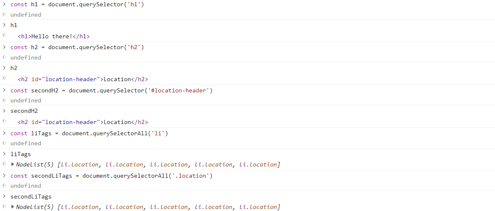
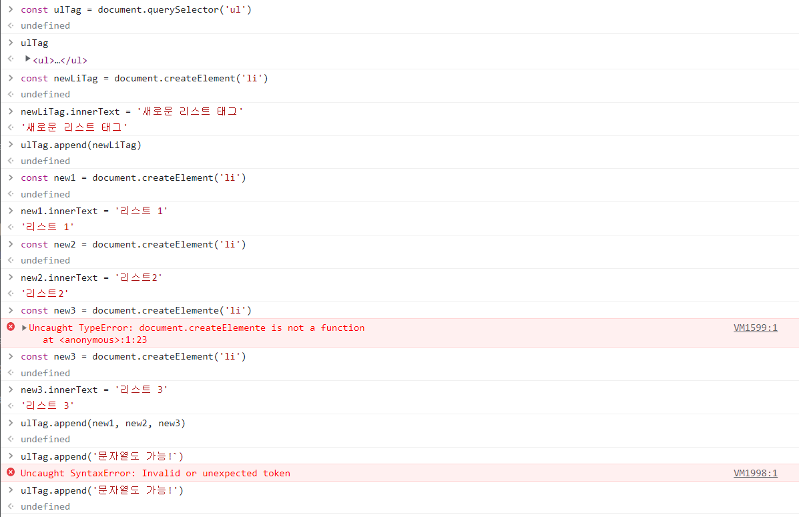
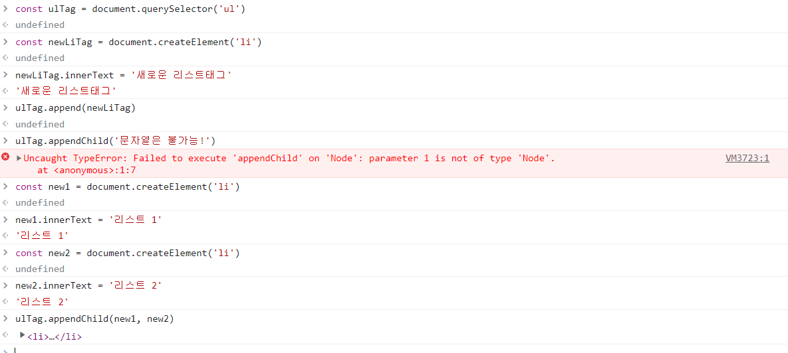

# Javascript_03

[TOC]


## DOM(Document Object Model)

### DOM 이란?

- HTML, XML과 같은 문서를 다루기 위한 문서 프로그래밍 인터페이스
- 문서를 구조화하고 구조화된 구성요소를 하나의 객체로 취급하여 다루는 논리적 트리 모델
- 문서가 구조화 되어 있으며 각 요소는 객체(object)로 취급
- 단순한 속성 적븐, 메서드 활용뿐만 아니라 프로그래밍 언어적 특성을 활용한 조작 가능
- 주요 객체
  - window: DOM을 표현하는 창. 가장 최상위 객체
  - document: 페이지 컨텐츠의 Entry Point 역할을 하며, `<body>`등과 같은 수많은 다른 요소들을 포함
  - navigator, location, history, screen


### DOM - 해석

- 파싱(Parsing)
  - 구문분석, 해석
  - 브라우저가 문자열을 해석하여 DOM Tree로 만드는 과정


### BOM이란?

- Browser Object Model

- 자바스크립트가 브라우저와 소통하기 위한 모델

- 브라우저의 창이나 프레임을 추상화해서 프로그래밍적으로 제어할 수 있도록 제공하는 수단

  - 버튼, URL 입력창, 타이틀 바 등등

- `window` 객체는 모든 브라우저로부터 지원받으며 브라우저의 창(window)을 지칭

  ```javascript
  window.open()
  window.print()
  window.confirm()
  window.document
  ```

### Javascript Core


## DOM 조작

### 개념

- Document: 문서한장(HTML)에 해당하고 이를 조작
- 조작 순서
  - 선택(Select)
  - 변경(Manipulation)

### Document 위치


### DOM 관련 객체의 상속

- EventTarget
  - Event Listener를 가질 수 있는 객체가 구현하는 DOM 인터페이스
- Node
  - 여러 가지 DOM 타입들이 상속하는 인터페이스

- Element
  - Document 안의 모든 객체가 상속하는 가장 범용적인 인터페이스
  - 부모인 Node와 그 부모인 EventTarget의 속성을 상속
- Document
  - 브라우저가 불러온 웹 페이지를 나타냄
  - DOM 트리의 진입점(entry point) 역할을 수행
- HTMLElement
  - 모든 종류의 HTML 요소
  - 부모 element의 속성 상속


### DOM 선택

#### 선택관련 메서드

- `document.querySelector(selector)`
  - 제공한 선택자와 일치하는 element 하나 선택
  - 제공한 `CSS selector`를 만족하는 첫 번째 element 객체를 반환(없으면 `null`)
- `document.querySelectorAll(selector)`
  - 제공한 선택자와 일치하는 여러 element를 선택
  - 매칭할 하나 이상의 셀렉터를 포함하는 유효한 `CSS selector`를 인자(문자열)로 받음
  - 지정된 셀렉터에 일치하는 `NodeList`를 반환
- `getElementById(id)`, `getElementsByTagName(name)`, `getElementsByClassName(names)`
  - 잘 안쓴다
- `querySelector()`와 `querySelectorAll()`를 사용하는 이유
  - `id`, `class`, `tag` 선택자 등을 모두 사용 가능하므로, 구체적이고 유연하게 선택 가능


#### 선택메서드별 반환 타입

- 단일 element
  - `getElementById()`
  - `querySelector()`
- HTMLCollection
  - `getElementsByTagName()`
  - `getElementByClassName()`
- NodeList
  - `querySelectorAll()`


#### HTMLCollection & NodeList

- 둘다 배열과 같이 각 항목에 접근하기 위한 index 제공
- 둘다 Live Collection으로 DOM의 변경사항을 실시간으로 반영
- :warning: 하지만 `querySelectorAll()`에 의해서 반환되는 NodeList는 Static Collection으로 실시간 반영되지 않으므로 주의

##### HTMLCollection

- `name`, `id`, `index` 속성으로 각 항목에 접근 가능

##### NodeList

- `index`로만 항목에 접근 가능
- 단 HTMLCollection과 달리 배열에서 사용하는 `forEach` 메서드 및 다양한 메서드 사용 가능


#### Collection

##### Live Collection

- 문서가 바뀔 때 실시간으로 업데이트 됨
- DOM의 변경사항을 실시간으로 collection에 반영
- HTMLCollection, NodeList

##### Static Collection(non-live)

- DOM이 변경되어도 collection 내용에는 영향을 주지 않음
- `querySelectorAll()`의 반환 NodeList만 여기에 해당


#### 실습

```html
<!DOCTYPE html>
<html lang="en">
<head>
  <meta charset="UTF-8">
  <meta http-equiv="X-UA-Compatible" content="IE=edge">
  <meta name="viewport" content="width=device-width, initial-scale=1.0">
  <title>Document</title>
  <style>
    .location {
      color: blue;
    }
  </style>
</head>
<body>
  <h1>Hello there!</h1>
  <h2 id="location-header">Location</h2>
  <div>
    <ul>
      <li class="location">서울</li>
      <li class="location">대전</li>
      <li class="location">광주</li>
      <li class="location">구미</li>
      <li class="location">부울경</li>
    </ul>
  </div>
</body>
</html>
```




### DOM 변경

#### 변경 관련 메서드

- `document.createElement()`
  - 작성한 태그 명의 HTML 요소를 생성하여 반환
- `Element.append()`
  - 특정 부모 Node의 자식 NodeList 중 마지막 자식 다음에 Node 객체나 DOMString을 삽입
  - 여러 개의 Node 객체, DOMString을 추가할 수 있음
  - 반환 값이 없음
- `Node.appendChild()`
  - 한 Node를 특정 부모 Node의 자식 NodeList 중 마지막 자식으로 삽입(Node만 추가 가능)
  - 한번에 오직 하나의 Node만 추가할 수 있음
  - 만약 주어진 Node가 이미 문서에 존재하는 다른 Node를 참조한다면 새로운 위치로 이동

#### 실습






#### `ParentNode.append()` vs `Node.appendChild()`

- 전자는 `DOMString` 객체도 추가할 수 있지만 후자는 `Node`객체만 허용
- 전자는 반환 값이 없지만 후자는 추가된 `Node`객체를 반환
- 전자는 여러 `Node`객체와 문자열을 추가할 수 있지만 후자는 하나의 `Node`객체만 추가할 수 있음
  - 위의 실습에서 마지막 `appendChild()`문의 결과를 확인해보면 좋을 것


#### 변경관련 속성(Property)

- `Node.innerText`
  - Node 객체와 그 자손의 텍스트 컨텐츠(DOMString)를 표현(사람이 읽을 수 있는 요소만 남김)
  - 줄바꿈인식, 숨겨진 내용은 무시하는 등 최종적으로 스타일링이 적용된 모습으로 표현
- `Element.innerHTML`
  - 요소(element) 내에 포함된 HTML 마크업을 반환
  - XSS 공격에 취약하므로 사용시 주의가 필요

#### 실습


#### XSS(Cross-site Scripting)

- 공격자가 입력요소를 사용하여(`<input>`) 웹 사이트 클라이언트 측 코드에 악성 스크립트를 삽입해 공격하는 방법
- 피해자의 브라우저가 악성 스크립트를 실행하며 공격자가 액세스 제어를 우회하고 사용자를 가장할 수 있도록 함


### DOM 삭제

#### 관련 메서드

- `ChildNode.remove()`
  - Node가 속한 트리에서 해당 Node를 제거
- `Node.removeChild()`
  - DOM에서 자식 Node를 제거하고 제거된 Node를 반환
  - Node는 인자로 들어가는 자식 Node의 부모 Node

#### 실습


### DOM 속성

#### 관련 메서드

- `Element.setAttribute(name, value)`
  - 지정된 요소의 값을 설정
  - 속성이 이미 존재하면 값을 갱신
  - 존재하지 않으면 지정된 이름과 값으로 새 속성을 추가
- `Element.getAttribute(attributeName)`
  - 해당 요소의 지정된 값(문자열)을 반환
  - 인자(attributeName)는 값을 얻고자 하는 속성의 이름

#### 실습


### DOM 조작 - 정리

- 선택한다
  - `querySelectore()`
  - `querySelectorAllI()`
- 변경/조작한다
  - `innerText`
  - `innerHTML`
  - `element.style.color`
  - `setAttribute()`
  - `getAttribute()`
  - `createElement()`
  - `appendChild()`


## Event

### 개념

- 네트워크 활동이나 사용자와의 상호작용 같은 사건의 발생을 알리기 위한 객체
- 마우스 클릭/ 키보드 입력/ 커서 올려놓기 등등 사용자 행동으로 발생 가능
- 또한 특정 메서드를 호출(`Element.click()`)하여 발생시킬 수도 있음


### Event 기반 인터페이스

- `AnimationEvent, ClipboardEvent, DragEvent` 등
- `UIEvent`
  - 간단한 사용자 인터페이스 이벤트
  - Event의 상속을 받음
  - `MouseEvent, KeyboardEvvent, InputEvent, FocusEvent` 등의 부모 객체 역할을 함


### Event의 역할

- {특정 이벤트}를 하면 {할 일}을 한다.
  - 예시) 클릭하면, 경고창을 띄운다.
  - 여기서 '클릭'하는 것이 이벤트고, '경고창을 띄'우는 행위는 단순한 결과이다.


### Event handler - addEventListener()

- `EventTarget.addEventListener()`
  - 지정한 이벤트가 대상에 전달될 때마다 호출할 함수를 설정
  - 이벤트를 지원하는 모든 객체(Element, Document, Window 등)를 대상으로 지정 가능
- `target.addEventListener(type, listener[, options])`
  - `type`: 반응 할 이벤트 유형(대소문자 구분 문자열)
  - `listener`: 지정된 타입의 이벤트가 발생했을 때 알림을 받는 객체. `EventListener` 인터페이스 혹은 `JS function`객체(콜백함수) 여야 함
- "대상에 특정 이벤트가 발생하면, 할일을 등록하자"
  - `EventTarget.addEventListener(type, listener)`
  - `EventTarget`: 대상
  - `type`: 특정 이벤트
  - `listener`: 할일


### 실습

- 버튼을 누르면 경고창 띄우기

```html
<button onclick="alertMessage()">
    나를 눌러봐!
</button>

<script>
const alertMessage = function () {
alert('메롱!!!')
}
</script>
```


### Event 취소

- `event.preventDefault()`
- 이벤트 중에 (우리의 의도와 상관없이) 기본값이 주어져 있는 경우가 있음
  - 예) p태그는 클릭했을 때 기본 동작이 없음. 반면 a 태그는 클릭했을 때 링크로 이동한다는 기본 동작이 있음
- 즉 이러한 `Default` 동작을 작동하지 않게하고 싶을 때 사용함. 그래서 항상 필요한 기능은 아님
- 현재 이벤트의 기본 동작을 중단
- HTML 요소의 기본동작을 작동하지 않게 막음
- 이벤트를 취소할 수 있는 경우, 이벤트의 전파를 막지 않고 그 이벤트를 취소
- 이벤트의 발생 자체를 막는게 아니라, 발생은 하지만 아무일도 안일어나는것
- https://developer.mozilla.org/en-US/docs/Web/Events


---

- event 취소에서 어떻게 막는다는건지..?
  - 그냥 그시점부터 중단하는건가? 색 바꾸는거나 그런건 중단시켜야겠다 생각하기전에 이미 일어나는데