- 유사배열
  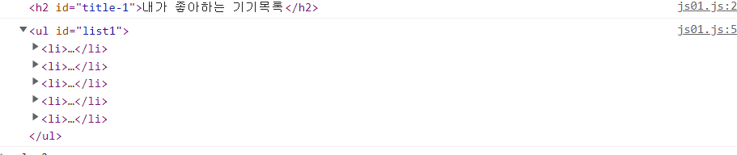

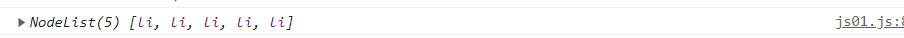

- 실제로 배열은 아닌데 배열과 유사하게 인덱스로 접근할 수 있어서 유사배열이라고 함
- `querySelectorAll`로 접근하면 유사배열로 반환해주는데, 위의 `li`처럼 여러개일 뿐만 아니라, 단일 객체만 있을 때도 유사배열에 담아서 반환해준다.


```javascript
const elem1 = document.querySelector('#list1')
const myHtml = elem1.innerHTML
console.log(myHtml)
```

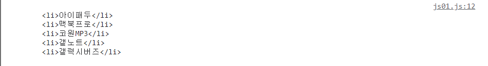

- 주의할 점은 앞에 들여쓰기까지 가져온다는 점


### outerHTML

```javascript
const myHtml = elem1.outerHTML
console.log(myHtml)
```

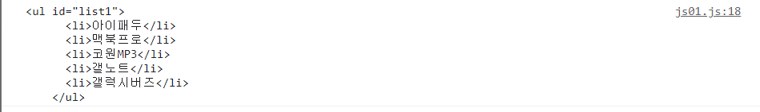

- outerhtml은 자기 자신도 포함해서 가져옴


### 자식노드 선택하기

```javascript
const firstElem = elem1.firstElementChild
console.log(firstElem)
```

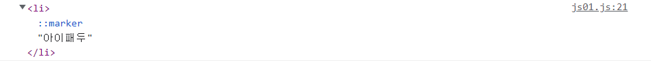


```javascript
const children = elem1.children
console.log(children)
console.log(children[0])
```

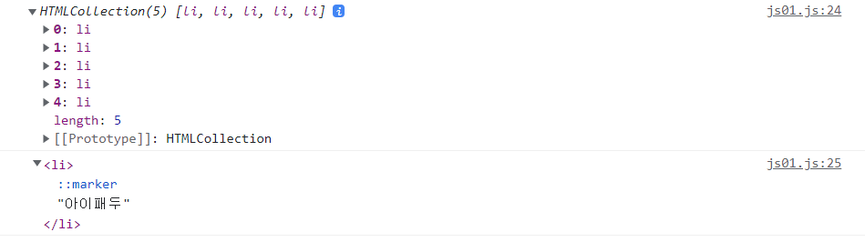

- `children`은 모든 자식노드를 유사배열로 가져오고, 거기서 인덱스로 접근이 가능


```javascript
const lastElem = elem1.lastElementChild
console.log(lastElem)
```

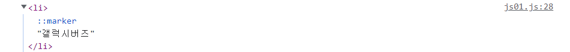


### 부모노드 선택하기

```javascript
const parent = elem1.parentElement
console.log(parent)
```

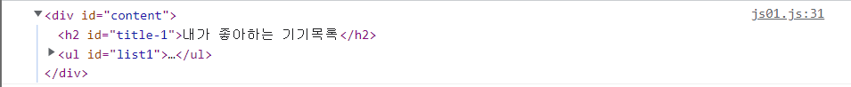


### 형제노드 선택하기

```javascript
const previous = elem1.previousElementSibling
console.log(previous)

const next = elem1.nextElementSibling
console.log(next)
```

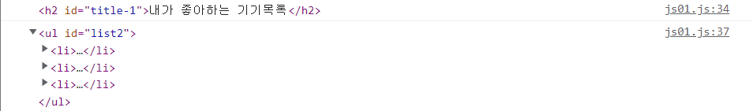


- textContent: 요소 안에 있는 내용들 중에서 html을 제외한 텍스트를 가져옴 
- innerHTML: 요소 안의 내용들 자체를 텍스트로 가져옴

```javascript
const elem1 = document.querySelector('#title-1')
const myText = elem1.innerHTML
console.log(myText)

const myText2 = elem1.textContent
console.log(myText2)

const elem2 = document.querySelector('#list1')
const myText3 = elem2.innerHTML
console.log(myText3)

const myText4 = elem2.textContent
console.log(myText4)
```

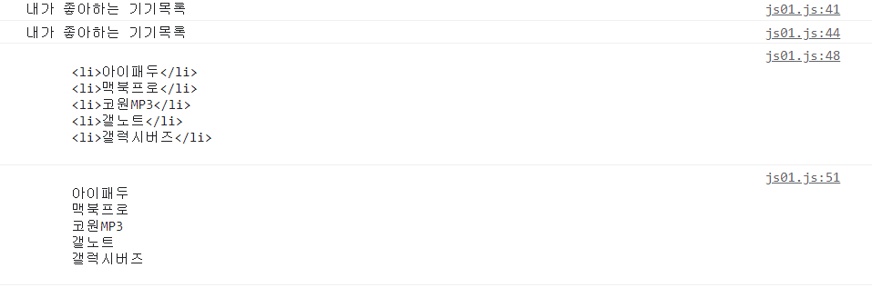


- outerHTML은 한번 변경을 하면 완전히 새로운 애가 된다??
  - 화면은 바뀌는데 여전히 바뀌기 전을 가리키고 있음??
- 그래서 복구시키려면 내가 변경해준 애를 `querySelector`를 이용해서 다시 찾아야함


### 삭제

```javascript
elem1.remove()
```


### 노드의 이동

```javascript
const elem1 = document.querySelector('#list1')
const buds = elem1.lastElementChild
console.log(buds)
const mac = elem1.children[1]
console.log(mac)
```

`append, prepend, before, after` 도 있으니 실습해보자


### 노드의 추가

- 노드의 생성 > 추가 순서

  ```javascript
  const newNode = document.createElement('li')
  newNode.textContent = '빔프로젝터'
  
  const elem2 = document.querySelector('#list2')
  elem2.append(newNode)
  console.log(elem2)
  
  // or
  const elem2 = document.querySelector('#list2').lastElementChild
  elem2.append(newNode)
  console.log(elem2)
  ```


### HTML 속성

```javascript
const elem1 = document.querySelector('#list1')
elem1.style.backgroundcolor = '#dd151d'
```

- 이렇게 하고나서 html css 코드를 보면 `inner style`로 들어감
- 근데 이경우는 우선순위가 굉장히 높아서 의도한 것과 다른 결과가 나타날 수 있음

- 첫번쨰, 스타일 우선순위가 높아져서 좋지 않고
- 두번째, 다른 곳에도 같은 스타일을 적용하려면 같은 코드를 작성해야 하기 때문에 불필요한 코드가 늘어날 수 있다.

- 그래서 자바스크립트로 스타일을 조작하는 것은 가급적 피해야 하며,
- 스타일은 스타일 시트를 활용하고, id와 클래스명을 조절하는 것으로 하는 것이 바람직하다.

```css
.RedBG {
  background-color: #dd151d;
}

.GreenBG{
    background-color: green;
}
```

- 이 상태에서 `html`에 가서 list1, list2에 각각 `RedBG` 클래스를 주면 붉은색 배경이 된다.

- 여기서 `list1`의 배경색을 초록색으로 바꾸려면?

  ```javascript
  elem1.className = 'GreenBG'
  //class의 이름을 변경할 때는 elem.class = ~ 이 아니라 elem.className을 써야함
  //or
  elem.setAttribute = 'GreenBG'
  ```

- 추가로 글자를 하얗게 하는 코드를 작성해보자

  ```css
  .WhiteFont {
      color: white;
  }
  ```

  이걸 적용하려면?

  ```javascript
  elem1.className = 'WhiteFont'
  //or
  elem1.setAttribute = 'WhiteFont'
  ```

  이렇게 하면 기존에 설정해놨던 클래스가 모두 사라져버리고 `WhiteFont`가 적용된다. 따라서 이런 경우에는 `className`이나 `setAttribute`가 아닌 `add, remove, toggle` + `classList`

  ```javascript
  elem1.classList.add('WhiteFont')
  ```

  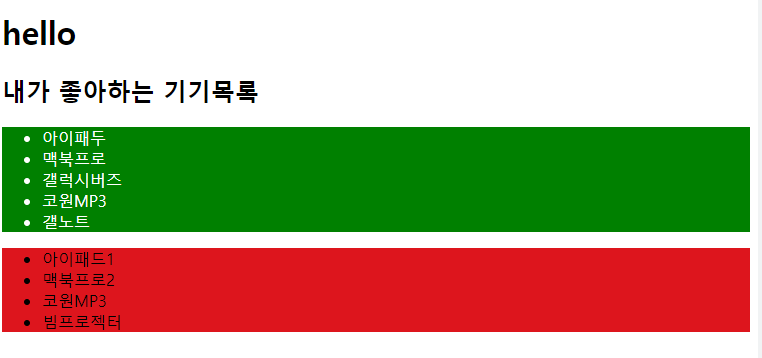


- toggle: 해당 클래스가 적용이 되어있으면 취소해주고, 없으면 설정해줌

  ```javascript
  elem1.classList.toggle('WhiteFont')
  elem1.classList.toggle('WhiteFont')
  //한줄씩 추가해보면서 어떤 변화가 있는지 확인해보자.
  ```

  

## Event

```javascript
function myClick() {
  console.log('눌렀구나?')
}

elem1.addEventListener('click', myClick)

//or

elem1.addEventListener('click', function () {
  console.log('또 눌렀구나?')
})
```

- 밑에 방식은 익명함수를 활용하는 방식인데, 이 방식을 사용하면 지우고 싶을 때 지울 수가 없음

```javascript
elem1.addEventListener('click', function () {
  console.log('또 눌렀구나?')
})

elem1.removeEventListener('click', function () {
  console.log('또 눌렀구나?')
})
```

- 이 경우에 위에 선언된 익명함수와 밑의 익명함수는 서로 다른 함수이다!
- 그래서 만약에 추가했다가, 지웠다가 하고 싶다면 event 추가부분의 첫번째 방법처럼 따로 함수를 정의해주어야 한다.


### Event 객체 확인하기

```javascript
function myClick(e) {
    console.log(e)
}

elem1.addEventListener('click', myClick)
```


### Event bubbling

```javascript
const contentElem = document.querySelector('#content')
const listElem = document.querySelector('#list1')

function myClick(e) {
  console.log('<-check count!')
}

contentElem.addEventListener('click', myClick)
listElem.addEventListener('click', myClick)
```

가장 바깥의 `content`에 `event`를 주고, 안쪽의 `list`에 같은 `event`를 줘보자. `content` 안쪽에 `#list1`과 겹치지 않는 영역을 클릭하면 `event`가 한번 호출되는데, `list1`영역을 클릭하면 `event`가 두번 호출됨. 이러한 현상을 `event bubbling`이라고 한다.

이런 현상은 같은 `event trigger`를 가진 경우에만 발생한다.

`event bubbling`은 계속 `bubbling`이 일어나다가 `document` 레벨을 만날때까지 발생한다.

- `event bubbling` 방지하기

  ```javascript
  contentElem.addEventListener('click', myClick)
  listElem.addEventListener('click', function (e) {
      e.stopPropagation()
      myClick(e)
  })
  ```

  

### Event target 확인하기

```javascript
function myClick(e) {
    console.log('hello')
    console.log(e.target)
    console.log(e.currentTarget)
}
contentElem.addEventListener('click', myClick)
listElem.addEventListener('click', myClick)
```


### 실습

- +, - 버튼을 누르면 화면의 숫자가 1씩 증감하는 페이지 만들기

#### 내 코드

````html
<!DOCTYPE html>
<html lang="en">
<head>
  <meta charset="UTF-8">
  <meta http-equiv="X-UA-Compatible" content="IE=edge">
  <meta name="viewport" content="width=device-width, initial-scale=1.0">
  <title>Document</title>
</head>
<body>
  <h1 id="number">0</h1>
  <button id="minusbtn">-</button>
  <button id="plusbtn">+</button>
  <script src="js02.js"></script>
</body>
</html>
````

```javascript
const minusbtn = document.querySelector('#minusbtn')
const plusbtn = document.querySelector('#plusbtn')
const num = document.querySelector('#number')

minusbtn.addEventListener('click', function() {
  num.innerHTML -= 1
})

plusbtn.addEventListener('click', function() {
  num.innerHTML = parseInt(num.innerHTML)+1
})
```


