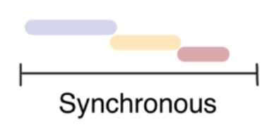
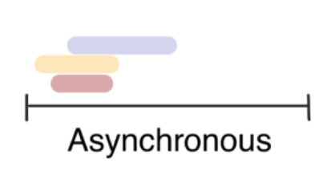

# AJAX

[TOC]


## AJAX

### AJAX란?

- Asynchronous JavaScript And XML(비동기식 JavaScript와 XML)
- 서버와 통신하기 위해 XMLHttpRequest 활용
- JSON, XML, HTML, 일반텍스트 등 다양한 포맷 주고받을 수 있음

### 특징

- 비동기성: 페이지 전체를 reload(새로고침)하지 않고서도 수행되는 특징. 따라서 서버의 응답에 따라 전체 페이지가 아닌 일부만을 업데이트 할 수도 있음
- 비동기성에 의해 다음과 같은 작업이 가능
  - 페이지 새로 고침 없이 서버에 요청
  - 서버로부터 데이터를 받고 작업을 수행

### XMLHttpRequest 객체

- 서버와의 상호작용에 사용
- 페이지 전체 새로고침없이 사용가능하며 페이지의 일부만 업데이트 가능
- 이름에는 XML이 들어가지만 모든 종류의 데이터를 받을 수 있음
- 생성자: `XMLHttpRequest`


## Asynchronous JavaScript

### 동기식(Synchronous)

- 순차적, 직렬적 Task 수행
- 요청을 보낸 후 응답을 받아야만 다음 동작 수행(blocking)

### 비동기식

- 병렬적 Task 수행
- 요청을 보낸 후 응답을 기다리지 않고 다음 동작이 이루어짐(non-blocking)
  

- 멀티태스킹과 헷갈리지 말것


### 비동기(Asynchronous)를 사용하는 이유: 사용자 경험(UX)

- 동기식 코드인 경우, 데이터를 모두 불러온 뒤 앱이 실행 됨
- 즉 데이터를 모두 불러오기 전까지는 앱이 멈춘 것처럼 보임
- 반면 비동기식 코드라면 데이터를 요청하고 응답 받는 동안 앱 실행을 함께 진행함
- 데이터를 불러오는 동안 지속적으로 응답하는 화면을 보여줌으로써 더욱 쾌적한 사용자 경험을 제공


### Threads

- 프로그램이 작업을 완료하기 위해 사용할 수 있는 단일 프로세스
- 각 스레드는 한번에 하나의 작업만 수행할 수 있음


### "JavaScript는 single threaded이다"

- 컴퓨터가 여러개의 CPU를 가지고 있어도 `main thread`라는 단일 스레드에서만 작업 수행
- 즉 이벤트를 처리하는 `Call Stack`이 하나인 언어라는 의미
- 이 문제를 해결하기 위해서 JS는
  - 즉시 처리하지 못하는 이벤트는 다른 곳(`Web API`)으로 보내서 처리하게 하고
  - 처리된 이벤트들은 처리된 순서대로 대기실(`Task queue`)에 줄을 세워 놓고
  - `Call Stack`이 비면 담당자(`Event Loop`)가 대기 줄에서 가장 오래된(제일 앞의) 이벤트를 `Call Stack`으로 보냄

### Concurrency model

> Event loop를 기반으로 하는 동시성 모델

- Call Stack
  - 요청이 들어올 때마다 해당 요청을 순차적으로 처리하는 Stack
- Web API(Browser API)
  - `JavaScript` 엔진이 아닌 브라우저 영역에서 제공하는 API
  - `setTimeout()`, `DOM events`, `AJAX`로 데이터를 가져오는 시간이 소요되는 일들을 처리
- Task Queue(Event Queue, Message Queue)
  - 비동기 처리된 callback 함수가 대기하는 Queue
  - main thread가 끝난 후 실행되어 후속 JavaScript 코드가 차단되는 것을 방지
- Event Loop
  - Call Stack이 비어있는지 확인
  - 비어있으면 Task Queue에서 실행 대기중인 callback 함수가 있는지 확인
  - Task Queue에 대기 중인 callback 함수가 있다면 가장 앞에 있는 callback 함수를 Call Stack으로 push

### Runtime


### Zero delays

- `setTimeout()`에 사용되는 시간제한은 실제로 그 시간 후에 callback 함수가 시작된다는 의미는 아님
- `delay`는 `JavaScript`가 요청을 처리하는 데 필요한 최소 시간이기 때문이고, 보장된 시간이 아님


### 순차적인 비동기 처리하기

- Web API로 들어오는 순서는 중요하지 않고, 어떤 이벤트가 **먼저** 처리되는지가 중요(즉, 실행순서 불명확함)
- 이를 해결하기 위해 순차적 비동기처리를 위한 2가지 방식에는 다음과 같은 방식이 있음
  - Async callbacks
    - 백그라운드에서 실행을 시작할 함수를 호출할 때 인자로 지정된 함수
    - 예시) `addEventListener()`의 두 번째 인자
  - promise-style
    - Modern Web APIs에서의 새로운 코드 스타일
    - `XMLHttpRequest` 객체를 사용하는 구조보다 조금 더 현대적 버전


## Callback Function

### Callback function

- 다른 함수에 인자로 전달된 함수
- 외부 함수 내에서 호출되어 일종의 루틴 또는 작업을 완료함
- 동기식, 비동기식 모두 사용됨
  - 주로 사용되는 건 비동기 작업이 완료된 후 코드 실행을 계속하는 용도
  - 이 경우를 비동기 콜백(asynchronous callback)이라고 함

### 예시

```javscript
const btn = document.querySelector('button')

btn.addEventListener('click', funciton () {
	alert('Completed!')
})
```


### Async callbacks

- 백그라운드에서 코드 실행을 시작할 함수를 호출할 때 인자로 지정된 함수
- 백그라운드 코드 실행이 끝나면 callback 함수를 호출하여 작업이 완료되었음을 알리거나 다음 작업을 실행하게 할 수 있음
- callback 함수를 다른 함수의 인수로 전달할 때, 함수의 참조를 인수로 전달할 뿐이지 즉시 실행되지 않고, 함수의 body에서 "called back" 됨.
- 정의된 함수는 때가되면 callback 함수를 실행하는 역할을 함


### Why use callback?

- callback 함수는 명시적인 호출이 아닌 특정 루틴 혹은 action에 의해 호출되는 함수
- event의 경우 "특정 이벤트가 발생하면" 이라는 조건으로 함수를 호출할 수 있었는데, 'Callback function'의 개념 덕분에 가능했던 것
- 비동기 로직을 수행할 때 callback 함수는 필수


### callback hell

- 여러 개의 연쇄 비동기 작업을 할 때 마주하게 되는 상황
- 순차적인 연쇄 비동기 작업을 처리하기 위해서 "callback함수를 호출하고, 그 다음 callback 함수를 호출하고 또 그 함수의 callback 함수를 호출하고..."의 패턴이 지속적으로 반복되는 것
- callback Hell 또는 pyramid of doom이라고 함
- 이런 경우 디버깅이 어려워지고, 코드 가독성이 떨어진다는 문제점


### callback Hell 해결하기

- Keep your code shallow(코드의 깊이를 얕게 유지)
- Modularize(모듈화)
- Handle every single error(모든 단일 오류 처리)
- **Promise callbacks(Promise 콜백 방식 사용)**


## Promise

### Promise object

- 비동기 작업의 최종 완료 또는 실패를 나타내는 객체
  - 미래의 완료 또는 실패와 그 결과 값을 나타냄
  - 미래의 어떤 상황에 대한 약속
  - 비동기 동작의 아직 사용할 수 없는 결과를 나타내는 객체
- 성공(이행)에 대한 약속: `.then()`
- 실패(거절)에 대한 약속: `.catch()`


### Promise methods

- pending 상태, fulfilled 상태, rejected 상태를 중심으로 움직이는게 promise 객체의 핵심 내용
- 모든 promise 객체는 맨 처음에는 pending 상태. 여기서 시작
- 그리고 성공하면 fulfilled 상태가 되고, 실패하면 rejected 상태가 됨
- 즉 pending 상태에서 fulfilled 상태가 되면 그때 `.then()`에 있는 callback을 실행하고, pending 상태에서 rejected 상태가 되면 `.catch()`에 있는 callback을 실행함

#### `.then(callback)`

- 이전 작업이 성공했을 때 수행할 작업을 나타내는 callback 함수
- 각 callback 함수는 이전 작업의 성공 결과를 인자로 전달받음
  - 비동기작업의 결과가 callback 함수의 첫번째 인자로 전달받는다는 것

- 따라서 성공했을 때의 코들르 callback 함수 안에 작성
- 각각의 `.then()` 블록은 서로 다른 `promise`를 반환
  - 그래서 `.then()`을 여러개 사용해서 연쇄적인 작업을 수행할 수 있음
  - 즉 여러 비동기 작업을 차례대로 수행할 수 있다는 것

#### `.catch(callback)`

- `.then`이 하나라도 실패하면 동작
- 이전 작업의 실패로 인해 생성된 `error` 객체는 `catch` 블록 안에서 사용할 수 없음

#### 주의

- 반환 값이 반드시 있어야 함
- 그래야 callback 함수가 이전의 `promise` 결과를 받을 수 있음

#### `.finally(callback)`

- `promise`객체를 반환
- 결과와 상관없이 무조건 지정된 callback 함수가 실행
- 어떠한 인자도 전달받지 않음
- 무조건 실행되어야 하는 절에서 활용
  - `.then()`과 `.catch()` 블록에서의 코드 중복 방지


### Promise가 보장하는 것

- callback 함수는 JavaScript의 EventLoop가 현재 실행 중인 Call Stack을 완료하기 이전에는 절대 호출되지 않음
  - Promise callback 함수는 Event Queue에 배치되는 엄격한 순서로 호출됨
- 비동기 작업이 성공하거나 실패한 뒤에 `.then()` 메서드를 이용하여 추가한 경우에도 위와 똑같이 동작
- `.then()`을 여러 번 사용하여 여러 개의 callback 함수를 추가할 수 있음(Chaining)
  - 각각의 callback은 주어진 순서대로 하나하나 실행하게 됨


## Axios

### Axios

- 브라우저를 위한 Promise 기반의 클라이언트
- 원래는 XHR이라는 브라우저 내장 객체를 활용해 AJAX 요청을 처리하는데 이보다 편리한 AJAX 요청이 가능하도록 도움을 줌

```html
axios.get(URL)
	.then(..)
	.catch(..)
```


---

- 16p에서는 js가 single threaded이기 때문에 alert이후의 코드는 alert의 처리가 끝날 때까지 실행되지 않는다고 하고..
- 18p에서는 js는 single threaded이기 때문에 기다리지 않는 방식으로 동작한다고 하고..?
- 그럼 `multi-threaded`인 언어도 있음?
- Zero delay 무슨말을 하고 싶은지는 알겠는데 내 용어로 정리가 안되니까 잘 정리해보자
- 백그라운드.. callback.. ..?


---

- AJAX: js를 이용해서 서버와 브라우저가 비동기적으로 데이터를 교환하는 방법

- settimeout은 시간 설정이 0이되었든 10000이 되었든 얘를 보자마자 Web API로 보냄

- 참고로 WebAPI와 Task Queue는 브라우저에서 처리하는 부분

- `.then()`메서드든 `.catch()` 메서드든 항상 promise 객체를 return 함

  - promise 객체를 리턴하는 경우
    - 리턴하는 promise 객체와 동일한 작업 성공결과와 상태를 갖게됨
  - promise 객체가 아닌 값을 리턴하는 경우
    - 숫자, 문자열, 객체... -> 항상 fulfilled 상태로 인식함(항상 성공한 상태로 인식한다는 것)
    - 그래서 계속해서 `.then`을 붙여쓸 수 있는 것
  - promise 객체가 아무런 값도 리턴하지 않는 경우
    - undefined가 리턴됨 -> 두번째 경우와 마찬가지로 fulfilled 상태를 가짐(성공)

  ```javascript
  axios.get('https://jsonplaceholder.typicode.com/users')
    .then( (res) => {
      console.log(res.data)
    })
    .then( (rlt) => {
      return console.log(rlt)
    })
    .catch( (err) => {
      console.log(err)
    })
  ```

  - 여기서 첫번째 then에 의해서 데이터가 출력된 다음에 undefined가 하나 출력됨. 왜냐하면 첫번째 then에서 undefined를 return 하기 때문인데, 이러한 undefined를 fulfilled로 인식하기 때문에 첫번째 then 이후에 catch로 넘어가는 것이 아니라 그 다음 then으로 넘어가는 것

- 사실 `catch()`는 `then()`과 같은 것. `then()`메서드는 첫번째 인자로 성공했을 때의 callback함수를 받고 두번째 인자로 실패했을 때의 callback 함수를 받기 때문

- `catch()`는 가장 아래에 배치하는 것이 일반적. 그런데 중간중간에 `catch()`를 넣는 경우가 많이 있음. then - catch - then 순서로 배치된다면 첫번째 then이 터지더라도 catch가 fulfilled 상태가 되면 두번째 then으로 이어갈 수 있기 때문