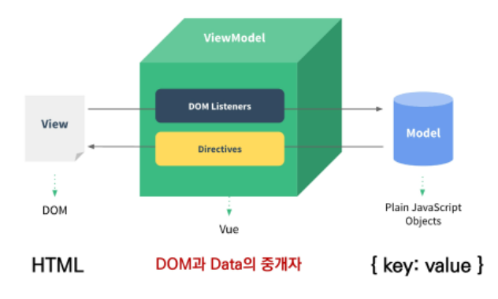

# Vue.js

[TOC]


## Intro

### Front-End Devlopment

- Vue.js? React?
  - Vue가 분업하기에 쉬움
    - Front-End Developer는 Data를 가져와서 화면에 뿌려주는 역할만할 수 있고, 디자이너는 Design 파일을 제공만 해도 괜찮도록 되어있음
    - 반면 React는 이러한 구조가 좀 섞여있음
    - 그래서 분업이 잘되어있는 국내 회사들은 Vue를 많이 사용하는 경향이 있음

### Vue.js

- 웹 페이지를 동적으로 그리기 위한 프레임워크
- 이전까지는 동적인 웹 페이지를 만들기 위해서는 1. 선택하고 2. 내용을 입력하고 3. 이벤트 등 기타작업의 과정을 거쳐야했는데, 이 과정을 더 편하게 하기 위한 것
- 현대적인 tool과 다양한 라이브러리를 통해 SPA(Single Page Application)를 완벽하게 지원

### SPA(Single Page Application)

- 우리가 보통 여러 페이지를 보는 것 같다고 생각하지만 실제로는 하나의 페이지임. 그리고 그 위에 내용의 일부가 바뀌거나 이벤트가 나타나거나 하는 것
- 이렇게 보고 있는 화면을 바꿔주는 일을 렌더링이라고 함
- 동작
  - 서버로부터 최초에만 페이지를 다운로드
  - 이후에는 동적으로 DOM을 구성 및 변경
- 동작 원리의 일부락 CSR(Client Side Rendering)의 구조를 따름

### CSR(Client Side Rendering)

- 브라우저가 해줌
- 장점
  - SSR의 단점
- 단점
  - SSR의 장점


### SSR(Server Side Rendering)

- 서버에서 클라이언트에게 보여줄 페이지를 모두 구성하여 전달하는 방식
- 장점
  - User가 한번에 페이지를 볼 수 있음
  - SEO(검색 엔진 최적화)에 적합
    - DOM에 이미 모든 데이터가 작성되어있기 때문
- 단점
  - 사용자가 요청할 때마다 새로운 페이지를 구성하여 전달해야 함
    - 반복되는 전체 새로고침으로 인해 UX가 떨어짐
    - 상대적으로 트래픽이 많아서 서버의 부담이 큼
- 장점은 취하면서 단점은 보완하기 위해 최근에는 SSR + CSR을 같이 사용함

### Vue.js의 역할

- MVVM
  - Model
  - View
  - View Model
- 여기서 View Model(VM) 부분을 Vue나 React가 담당하는 것


## Why Vue.js

```javascript
const app = new Vue({
	el: '#app',
    data: {
        username: 'Unknown'
    },
    methods: {
        onInputChange: function (event) {
            this.username = event.target.value
        }
    }
})
```

- `el`은 `element`의 약자로 저렇게만 써야함 외우자.


## Concepts of Vue.js

### MVVM Pattern in Vue.js




## Vue version 2  vs 3

- Vue 2로 학습하고 **필요하면** Vue 3로 이전하는게 효과적

## Quick Start of Vue.js

### 코드 작성 순서

- "Data가 변화하면 DOM이 변경"

  :one: Data 로직 작성

  :two: DOM 작성


## Basic syntax of Vue.js

### Vue instance

- 모든 Vue 앱은 Vue 함수로 새 인스턴스를 만드는 것부터 시작

- Vue 인스턴스를 생성할 때는 Options 객체를 전달해야함

  ```javascript
  const app = new Vue({
      
  })
  ```

### Options/DOM - 'el'

- Vue 인스턴스에 연결(마운트) 할 기존 DOM 요소가 필요

- CSS 선택자 문자열 혹은 HTML Element로 작성

- `new`를 이용한 인스턴스 생성 때만 사용

  ```javascript
  const app = new Vue({
      el: '#app'
  })
  ```

### Options/Data - 'data'

- Vue 인스턴스의 데이터 객체

- Vue 인스턴스의 상태 데이터를 정의하는 곳

- Vue template에서 interpolation(보간법)을 통해 접근 가능

- v-bind, v-on 등과 같은 directive에서도 사용 가능

- Vue 객체 내 다른 함수에서 `this` 키워드를 통해 접근 가능

  ```javascript
  const app = new Vue({
      el: '#app',
      data: {
          message: 'Hello',
      }
  })
  ```

### Options/Data - 'methods'

- Vue 인스턴스에 추가할 메서드

- Vue template에서 interpolation을 통해 접근 가능

- v-on과 같은 directive에서도 사용 가능

- Vue 객체 내 다른 함수에서 this 키워드를 통해 접근 가능

- 주의점

  - 화살표 함수를 메서드를 정의하는데 사용하면 안됨
  - 화살표 함수가 부모 컨텍스트를 바인딩하기 때문에, `this`는 Vue 인스턴스가 아님

  ```javascript
  const app = new Vue({
      el: '#app',
      data: {
          message: 'Hello',
      },
      methods: {
          greeting: function () {
              console.log('hello')
          }
      }
  })
  ```

### 'this' keyword in vue.js

- Vue 함수 객체 내에서 vue 인스턴스를 가리킴
- 화살표 함수를 사용하면 안 되는 경우
  - data
  - method 정의


## Template Syntax

### Template Syntax

- 렌더링 된 DOM을 기본 Vue 인스턴스의 데이터에 선언적으로 바인딩할 수 있는 HTML 기반 템플릿 구문을 사용
  - Interpolation
  - Directive

### Interpolation

- Text
- Raw HTML
- Attributes
- JS 표현식

### Directive

- v-접두사가 있는 특수 속성
- v-for를 제외한 속성 값은 단일 JS 표현식이 됨
- 표현식의 값이 변경될 때 반응적으로 DOM 에 적용하는 역할
- 전달인자(Arguments): `:`
- 수식어(Modifiers): `.`

### v-text

- 엘리먼트의 textContent를 업데이트

- `{{ message }}`랑 걍 똑같음

  - `<p v-text="message"></p>`

  - `<p>{{ message }}</p>` 위에거랑 똑같은거

### v-html

- 거의 안씀

### v-show

- 조건부 렌더링 중 하나
- 요소는 항상 렌더링되고 DOM에 남아있음
- 단순히 엘리먼트에 display CSS 속성을 토글하는 것

### v-if, v-else-if, v-else

- 조건부 렌더링
- directive의 표현식이 true일 때만 렌더링
- 엘리먼트 및 포함된 directive는 토글하는 동안 삭제되고 다시 작성됨

### v-show

- CSS display 속성을 hidden으로 만들어 토글
- 실제로 렌더링은 되지만 눈에 보이지 않는 것
- 자주 변경되는 요소에 사용하는 것이 렌더링 비용이 낮아 v-if에 비해 효율적

### v-if

- 전달인자가 false인 경우 렌더링 되지 않음
- 화면에서 안보이는 것 뿐만 아니라 렌더링 자체가 되지 않음
- 자주 변경되는 요소에는 다시 렌더링 해야 하므로 비용이 증가할 수 있음

### v-for

- 원본 데이터를 기반으로 엘리먼트 or 템플릿 블록을 여러 번 렌더링
- `item in itmes`
- v-for 사용시 반드시 key 속성을 각 요소에 작성
- v-if와 함께 사용하는 경우 v-for가 더 우선순위가 높음
  - 가급적 동시에 사용하지 말 것

### v-on

- 엘리먼트에 이벤트 리스너 연결
- 이벤트 유형은 전달인자로 표시
- 특정 이벤트가 발생했을 때, 주어진 코드가 실행됨
- 약어
  - @
  - `v-on:click` -> @click

### v-bind

- HTML 요소의 속성에 Vue의 상태 데이터를 값으로 할당
- Object 형태로 사용하면 value가 true인 key가 class 바인딩 값으로 할당
- `:`가 약어
  - `v-bind:href`: `:href`


### v-model

- HTML form 요소의 값과 data를 양방향 바인딩
- 수식어
  - `.lazy`: input 대신 change 이벤트 이후에 동기화
  - `.number`: 문자열을 숫자로 변경
  - `.trim`: 입력에 대한 trim을 진행

### Options/Data - 'computed'

- 데이터를 기반으로 하는 계산된 속성
- 함수의 형태로 정의하지만 함수가 아닌 함수의 반환 값이 바인딩 됨
- 종속된 데이터에 따라 저장(캐싱)됨
- 종속된 데이터가 변경될 때만 함수를 실행
- 즉, 어떤 데이터에도 의존하지 않는 computed 속성의 경우 절대로 업데이트 되지 않음
- 반드시 반환 값이 있어야 함

### computed & methods

- computed 속성 대신 methods에 함수를 정의할 수도 있음
  - 최종 결과에 대해 두 가지 접근 방식은 서로 동일
- 차이점은 computed 속성은 종속 대상을 따라 저장(캐싱)됨
- 즉, computed는 종속된 대상이 변경되지 않는 한 computed에 작성된 함수를 여러 번 호출해도 계산을 다시 하지 않고 계산되어 있던 결과를 반환
- 이에 비해 methods를 호출하면 렌더링을 다시 할 때마다 항상 함수를 실행

### Options/Data -'watch'

- 데이터를 감시
- 데이터에 변화가 일어났을 때 실행되는 함수

### computed & watch

- computed
  - 특정 데이터를 직접적으로 사용/가공하여 다른값으로 만들 때 사용
  - 속성은 계산해야 하는 목표 데이터를 정의하는 방식으로 소프트웨어 공학에서 이야기 하는 '선언형 프로그래밍' 방식
  - "특정 값이 변동하면 해당 값을 다시 계산해서 보여준다."
- watch
  - 특정 데이터의 변화 상황에 맞춰 다른 data 등이 바뀌어야 할 때 주로 사용
  - 감시할 데이터를 지정하고 그 데이터가 바뀌면 특정 함수를 실행하는 방식
  - 소프트웨어 공학에서 이야기하는 '명령형 프로그래밍' 방식
  - "특정 값이 변동하면 다른 작업을 한다."
  - 특정 대상이 변경되었을 때 콜백함수를 실행시키기 위한 트리거
- 즉 computed와 watch는 어느것이 더 우월한지의 문제가 아니라 사용하는 목적과 상황이 다름

### 선언형 & 명령형

- 선언형 프로그래밍: 계산해야 하는 목표 데이터를 정의(computed)
- 명령형 프로그래밍: 데이터가 바뀌면 특정 함수를 실행(watch)

### Options/Assets - 'filter'

- 텍스트 형식화를 적용할 수 있는 필터
- interpolation 혹은 v-bind를 이용할 때 사용 가능
- 필터는 자바스크립트 표현식 마지막에 '|'와 함께 추가되어야 함
- 이어서 사용(chaining)가능


## Lifecycle Hooks

### Lifecycle Hooks

- 각 Vue 인스턴스는 생성될 때 일련의 초기화 단계를 거침
- 그 과정에서 사용자 정의 로직을 실행할 수 있는 Lifecycle Hooks도 호출됨
- 공식문서 참고
  - [공식문서](https://vuejs.org/v2/guide/instance.html#Lifecycle-Diagram)


---

- new를 이용하지 않는 인스턴스 생성 방법은 무엇일까(56p)
- '바인딩'에 대해서.
- methods는 v-on에는 되고 v-bind에는 안되나봄?
- data나 method나 directive에서 사용하는 경우 찾아보자.