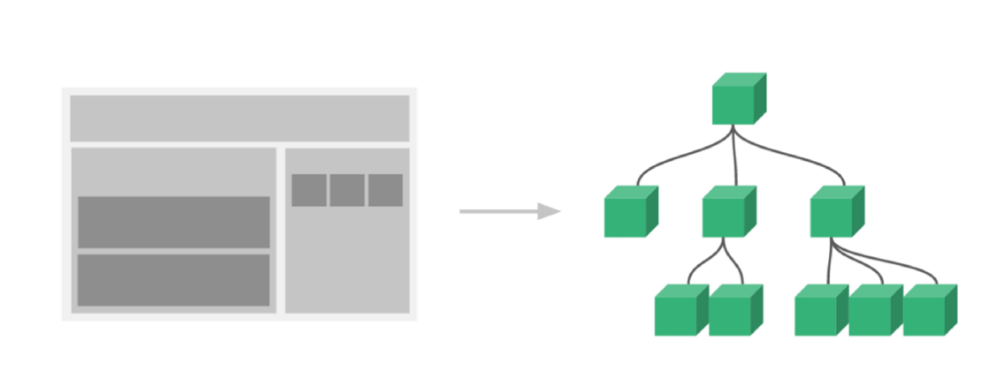

# Vue 02


## SFC(Single File Component)

### SFC(Single File Component)

- Vue의 컴포넌트 기반 개발의 핵심 특징
- 하나의 컴포넌트는 `.vue` 확장자를 가진 하나의 파일 안에서 작성되는 코드의 결과물
- 화면의 특정 영역에 대한 HTML, CSS, JavaScript 코드를 하나의 파일(`.vue`)에서 관리
- 즉 `.vue` 확장자를 가진 싱글 파일 컴포넌트를 통해 개발하는 방식
- Vue 컴포넌트 === Vue 인스턴스 === `.vue` 파일

### 단일 파일 관리

- 코드의 양이 많아질수록
  - 변수 관리 어려움
  - 유지보수 비용 증가

### 여러 컴포넌트

- 기능 별로 파일을 나눠서 개발
- 처음 개발 준비 단계에서는 시간이 단일파일에 비해 많이 필요
- 하지만 코드 양이 많아지면서
  - 변수 관리가 용이하고
  - 기능별로 유지보수 비용이 감소

### Vue Component 구조



- 한 화면 내에도 기능 별로 각기 다른 컴포넌트 존재
  - 하나의 컴포넌트가 여러 개의 하위 컴포넌트를 가질 수 있음
  - Vue는 컴포넌트 기반의 개발환경 제공
- Vue 컴포넌트는 `const app = new Vue({ ... })` 에서의 `app`을 의미(=== Vue 인스턴스)
  - 오해하기 쉬운 점은 컴포넌트 기반의 개발이 반드시 파일 단위로 구분되어야 하는 것은 아님
  - 단일 `.html` 파일 내에서도 여러 개의 컴포넌트를 만들어 개발 가능


## Vue CLI

### Vue CLI

- `Vue.js` 개발을 위한 표준 도구
- 프로젝트 구성을 도와줌
- 확장 플러그인, GUI, Babel 등 다양한 tool 제공

### Node.js

- 자바스크립트를 브라우저가 아닌 환경에서도 구동할 수 있도록 하는 자바스크립트 런타임 환경
  - Chrome V8 엔진을 브라우저에서만 사용하는 것에서 벗어남
- 브라우저만 조작할 수 있던 자바스크립트를 SSR 아키텍처에서도 사용할 수 있게 됨

### NPM(Node Package Manage)

- 자바스크립트 언어를 위한 패키지 관리자
  - Python의 pip 같은 역할
  - pip와 마찬가지로 다양한 의존성 패키지 관리
- Node.js의 기본 패키지 관리자


## Babel & Webpack

### Babel

- JavaScript Compiler
- 자바스크립트의 ECMAScript 2015+ 코드를 이전 버전으로 번역/변환해주는 도구
- 과거 자바스크립트의 파편화/표준화의 영향으로 코드 스펙트럼이 매우 다양
  - 이로인해 최신 문법을 사용해도 이전 브라우저 혹은 환경에서 동작하지 않는 상황 발생하면서 필요성 증대

### Webpack

- static module bundler
- 모듈 간의 의존성 문제를 해결하기 위한 도구
- 프로젝트에 필요한 모든 모듈을 매핑하고 내부적으로 종속성 그래프를 빌드

### Static Module Bundler

- 모듈은 파일 하나를 의미
- Module 의존성 문제 발생
  - 모듈의 수가 점차 많아지고 라이브러리/모듈 간의 의존성이 깊어지면서 특정한 곳에서 발생한 문제가 정확히 어떤 모듈 간의 문제인지 파악이 어려워지는 문제
  - 이러한 문제를 해결하기 위해 등장한 것이 Webpack
- Bundling이란 모듈 의존성 문제를 해결해주는 작업이고, 이러한 작업을 해주는 도구가 Bundler
  - Webpack은 다양한 Bundler 중 하나
- 여러 모듈을 하나로 묶어주고, 묶인 파일은 하나로 합쳐짐
- Bundling 된 결과물은 더 이상 순서에 영향을 받지 않고 동작하게 됨

### Vue 프로젝트 구조

- 38p~ 참고

## Pass props & Emit event

### 컴포넌트 작성

- Vue app은 중첩된 컴포넌트 트리로 구성
- 부모-자식간 의사소통 필요
- 부모는 자식에게 데이터를 전달(Pass props)하며, 자식은 자신에게 일어난 일을 부모에게 알림(Emit event)

### 컴포넌트 구조

- 템플릿(HTML) + 스크립트(JavaScript) + 스타일(CSS)

#### 템플릿(HTML)

- HTML의 body부분
- 각 컴포넌트 작성

#### 스크립트(JavaScript)

- Javascript 작성하는 곳
- 컴포넌트 정보, 데이터, 메서드 등 vue 인스턴스를 구성하는 대부분을 작성

#### 스타일(CSS)

- CSS가 작성되며 컴포넌트의 스타일을 담당

### 컴포넌트 등록 3단계

- 불러오기(import), 등록하기(register), 보여주기(print)

### Props

- 부모 컴포넌트의 정보를 전달하기 위한 사용자 지정 특성
- 자식 컴포넌트는 props 옵션을 사용하여 수신하는 props를 명시적으로 선언해야 함
- 주의할 점은 모든 컴포넌트 인스턴스에는 자체 격리된 범위가 있어서 자식 컴포넌트의 템플릿에서 상위 데이터를 직접 참조할 수 없음

### Static Props 작성

- 자식 컴포넌트(About.vue)에 보낼 prop 데이터 선언
- 작성법: `prop-data-name="value"`
- 수신할 prop 데이터를 명시적으로 선언 후 사용

### Dynamic Props 작성

- `v-bind directive`를 사용해 부모의 데이터의 props를 동적으로 바인딩
- 부모에서 데이터가 업데이트 될 때마다 자식 데이터로도 전달 됨
- 수신할 prop 데이터를 명시적으로 선언 후 사용

### Props 이름 컨벤션

- 선언시: camelCase
- in template: kebab-case

### 컴포넌트의 'data'는 반드시 함수여야 함

- 기본적으로 각 인스턴스는 모두 같은 data 객체를 공유하므로 새로운 data 객체를 return 하여야 함

### Props 시 자주하는 실수

- Static 구문을 사용하여 숫자를 전달하려고 하는 것

- JS 숫자를 전달하려면 값이 JavaScript 표현식으로 평가되도록 v-bind를 사용해야함

  ```html
  <!--일반 문자열 "1"을 전달-->
  <comp some-prop="1"></comp>
  
  <!--실제 숫자로 전달-->
  <comp :some-prop="1"></comp>
  ```

### 단방향 데이터 흐름

- 모든 props는 하위 속성과 상위 속성 사이의 단방향 바인딩을 형성
- 부모의 속성이 변경되면 자식 속성에 전달되나, 반대의 경우는 안됨
- 부모 컴포넌트가 업데이트될 때마다 자식 요소의 모든 prop들이 최신 값으로 업데이트 됨

### Emit event

- `$emit(eventName)`
  - 현재 인스턴스에서 이벤트를 트리거
  - 추가 인자는 리스너의 콜백 함수로 전달
  - 부모 컴포넌트는 자식 컴포넌트가 사용되는 템플릿에서 `v-on`을 사용하여 자식 컴포넌트가 보낸 이벤트를 청취

### event 이름 컨벤션

- 컴포넌트 및 props와는 달리, 이벤트는 자동 대소문자 변환 제공 X

- 이벤트 이름에는 항상 kebab-case 사용을 권장

  - HTML의 대소문자 구분을 위해 DOM 템플릿의 v-on 이벤트 리스너는 항상 자동으로 소문자 변환되기 때문

  

## Vue Router

### Vue Router(66p)

- 라우트(route)에 컴포넌트를 매핑한 후, 어떤 주소에서 렌더링할 지 알려줌
- SPA 상에서 라우팅을 쉽게 개발할 수 있는 기능을 제공
- 

## Youtube Project


---

- 컴포넌트 단위의 개발
  - 반드시 파일단위로 구분되어야 하는건 아니라는 말이 `html` 파일을 말하는거겠지?
  - `.vue`를 단위로 한다면 반드시 파일 단위로 구분되어야 하는거고