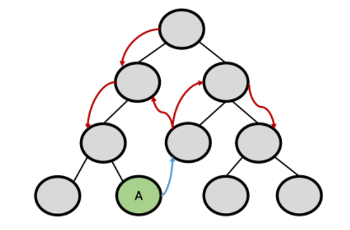
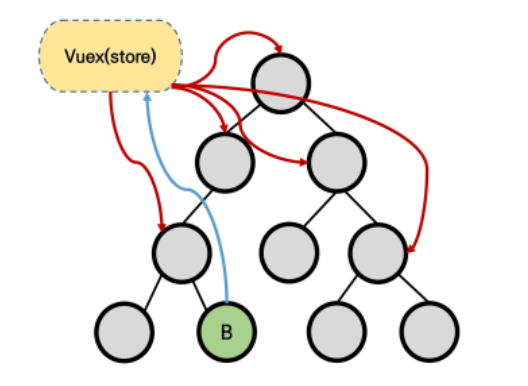
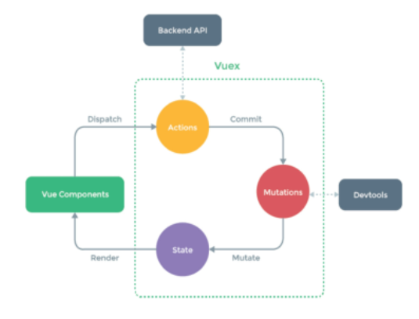
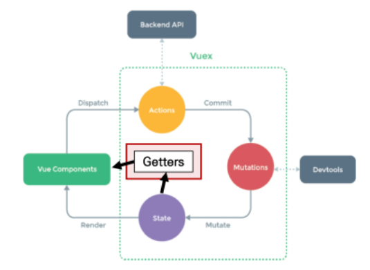

# Vuex

## Vuex intro

### Vuex

- "Statement management pattern + Library" for vue.js
  - **상태 관리** 패턴 + 라이브러리
- 상태(state)를 전역 저장소로 관리할 수 있도록 지원하는 라이브러리
  - 상태가 예측 가능한 방식으로만 변경될 수 있도록 보장하는 규칙 설정
  - 애플리케이션의 모든 컴포넌트에 대한 **중앙 집중식 저장소** 역할
- Vue의 공식 devtools와 통합되어 기타 고급 기능 제공

### State

- 컴포넌트간 통신이, 간단하면 괜찮은데 많은 컴포넌트가 필요한 경우라면 매우 복잡해짐
- 일단은 State는 곧 data라고 생각하면 된다.
- 중앙에서 관리하는 모든 상태정보

### 상태 관리 패턴

- 컴포넌트의 공유된 상태를 **전역에서 관리**
- 중앙 집중식.. 전역에서 관리.. 비슷한 느낌이 드는 표현들이라는 점만 인식하고 넘어가자

### 기존의 Psss props & Emit event

- 각 컴포넌트는 독립적으로 데이터를 관리
- 데이터는 단방향 흐름으로 부모에서 자식으로의 전달만 가능하며 반대의 경우는 이벤트를 트리거만 할 수 있음
- 장점
  - 데이터의 흐름을 직관적으로 파악 가능
    - 딱 한단계 위로 연결되어있는 부모-자식 간에만 통신을 하기 때문
- 단점
  - 컴포넌트 중첩이 깊어지는 경우 동위관계의 컴포넌트로의 데이터 전달이 불편
    - 같은 레벨의 컴포넌트에 전달하려면 위로 전달했다가, 전달받은 부모 컴포넌트에서 다시 아래로 전달해야 함
- 단방향 데이터 흐름
  - state: 앱을 작동하는 원본소스(data)
  - view: state의 선언적 매핑
  - action: view에서 사용자 입력에 대해 반응적으로 state를 바꾸는 방법(methods)
  - 일단 state는 data, action은 methods 라고 알고 가자

### Vuex management pattern

- 기존의 방식
  

- Vuex 방식
  

- 중앙 저장소(store)에 state를 모아놓고 관리
  - state는 data로 치환해서 이해해도 무방하다
- 규모가 큰(컴포넌트 중첩이 깊은) 프로젝트에서 매우 효율적
- 각 컴포넌트에서는 중앙 집중 저장소의 state만 신경쓰면 됨
  - 동일한 state를 공유하는 다른 컴포넌트들도 동기화 됨
- 필수일까?
  - 그건 아님
  - 구조가 작은 경우에는 기존의 방식이 더 나을 수 있음

### 단방향 흐름에 의존한 state(상태) 관리

- 즉 기존의 방식을 말함
  1. 부모 자식 간 컴포넌트 관계가 단순하거나 depth가 깊지 않은 경우 문제 없음
     - 몇단계만 거치면 데이터를 쉽게 이동할 수 있고, 직관적으로 데이터 흐름 파악이 가능하다는 장점
  2. 규모가 커지는 경우 관리가 어려워짐
     - 상태를 공유하는 컴포넌트의 상태 동기화 관리가 어렵고
     - 상태를 전달할 때 위에서 아래로만 전달이 가능하다는 단점
  3. A 컴포넌트의 상태를 공유하는 다른 컴포넌트에 pass props & emit event를 통해 동기화해야 함

### Vuex를 활용한 state 관리

1. 상태 변화에 따른 여러 흐름을 모두 관리해야 하는 불편함을 해소할 필요가 있음
   - 상태는 데이터를 주고 받는 컴포넌트 간의 관계도 충분히 고려해야 하기 때문에 상태 흐름 관리가 매우 중요
2. 결국 이러한 상태를 올바르게 관리하는 저장소의 필요성을 느끼게 됨
   - 상태를 한 곳(store)에 모두 모아서 관리하자
   - 상태의 변화는 모든 컴포넌트에서 공유
   - 상태의 변화는 오로지 Vuex가 관리하여 해당 상태를 공유하고 있는 모든 컴포넌트는 변화에 반응
3. A 컴포넌트와 같은 상태를 공유하는 다른 컴포넌트는 신경 쓰지 않고, 오로지 상태의 변화를 Vuex에 알림

## Vuex Core Concepts

### Vuex 핵심 컨셉

- State, Mutations, Actions, Getters
- 

- 먼저 state(data, 보라색)가 바뀌면 화면(Vue Components, 초록색)이 바뀜
- 화면에서 어떤 상호작용(interaction)이 일어나면 행동을 하게 됨
  - 예를 들어 어떤 요소를 클릭하면 어떤 함수를 부르게 되는데, 그 함수가 Actions(노란색)
- Mutations(빨간색): data의 변경을 담당
  - 노란색 Actions는 함수이자 **모든** 행동을 의미
  - 이러한 함수 중에서 어떤 애들은 data의 변경을 담당하는 중요한 역할을 함. 예를 들어서 CRUD에서 R은 data를 변경시키지 않지만, C, U, D는 data를 변경시킴
- 이렇게 데이터의 변경이 일어나면(mutate) state가 변화함
- 그림에서 볼 수 있듯 Vuex가 담당하는 부분은 Actions, Mutations, State

### State

- 중앙에서 관리하는 모든 상태 정보(data)
- Vuex는 single state tree를 사용
  - 즉 이 단일 객체는 모든 애플리케이션 상태를 포함하는 "원본소스(single source of truth)"의 역할을 함
- 각 애플리케이션마다 하나의 저장소만 갖게 된다는 것을 의미
- 여러 컴포넌트 내부에 있는 특정 state를 중앙에서 관리
  - 이전에는 state를 찾기 위해 각 컴포넌트를 직접 확인해야 했음
  - Vuex를 활용하면 Vuex Store에서 각 컴포넌트에서 사용하는 state를 한 눈에 파악 가능
- state가 변화하면 해당 state를 공유하는 여러 컴포넌트의 DOM은 (알아서) 바뀜(렌더링)
- 각 컴포넌트는 이제 Vuex Store에서 state 정보를 가져와서 사용

### Mutations

- 실제로 state를 변경하는 **유일한** 방법
  - 그래서 위험한 작업
- mutation의 handler(핸들러 함수)는 반드시 동기적이어야 함
  - 비동기적 로직(ex 콜백함수)은 state가 변화하는 시점이 의도한 것과 달라질 수 있으며, 콜백이 실제로 호출될 시기를 알 수 있는 방법이 없음(추적불가)
  - state가 변경되는 일은 매우 중요한 일인데 비동기적 로직은 '나중에 언젠가 변경할게요~'라는 식으로 작업을 하게 된다는 것
- 첫번째 인자로 항상 state를 받음
- Actions에서 `commit()` 메서드에 의해 호출

### Actions

- Mutations와 유사하지만 차이점 있음
  - state를 변경하는 대신 mutations를 `commit()` 메서드로 호출해서 실행
  - mutations와 달리 비동기 작업이 포함될 수 있음
- `context` 객체 인자를 받음
  - context 객체를 통해 store/index.js 파일 내에 있는 모든 요소의 속성 접근 & 메서드 호출이 가능
  - (가능하긴 하지만) state를 직접 변경하지 않음
- 컴포넌트에서 `dispatch()` 메서드에 의해 호출됨
- 어지간한 거의 모든 일들은 Actions가 하고, state를 변경하는 것만 Mutations가 함

### Getters

- state를 변경하지 않고 활용하여 계산을 수행(computed 속성과 유사)
  - compute를 사용하는 것처럼 getters는 저장소의 상태(state)를 기준으로 계산
  - 예를 들어, state에 todoList라는 해야 할 일의 목록의 경우 완료도니 todo목록만을 필터링해서 출력해야 하는 경우
- computed 속성과 마찬가지로 getters의 결과는 state 종속성에 따라 캐시(cached) 되고, 종속성이 변경된 경우에만 다시 재계산됨
- getters 자체가 state를 변경하지는 않음
  - state를 특정한 조건에 따라 구분(계산)만 함
  - 즉, 계산된 값을 가져옴

## Vuex Todo App

- 주의할점은 `Vuex`는 공식적으로 `Vue`가 가지고 있는 기능이 아님
- 하지만 너무 많은 사람들이써서 파트너쉽을 체결한 그런 느낌
- 앱을 만들때 vue에서 가장 먼저해야하고 가장 중요한거
  - 모델링
  - 컴포넌트 구조